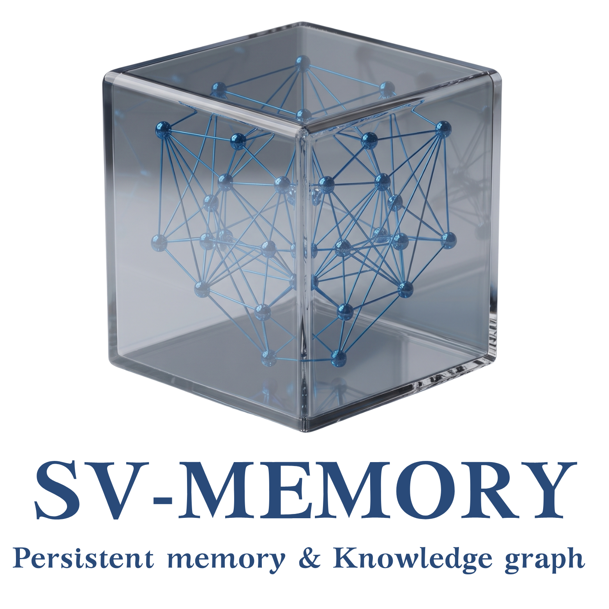
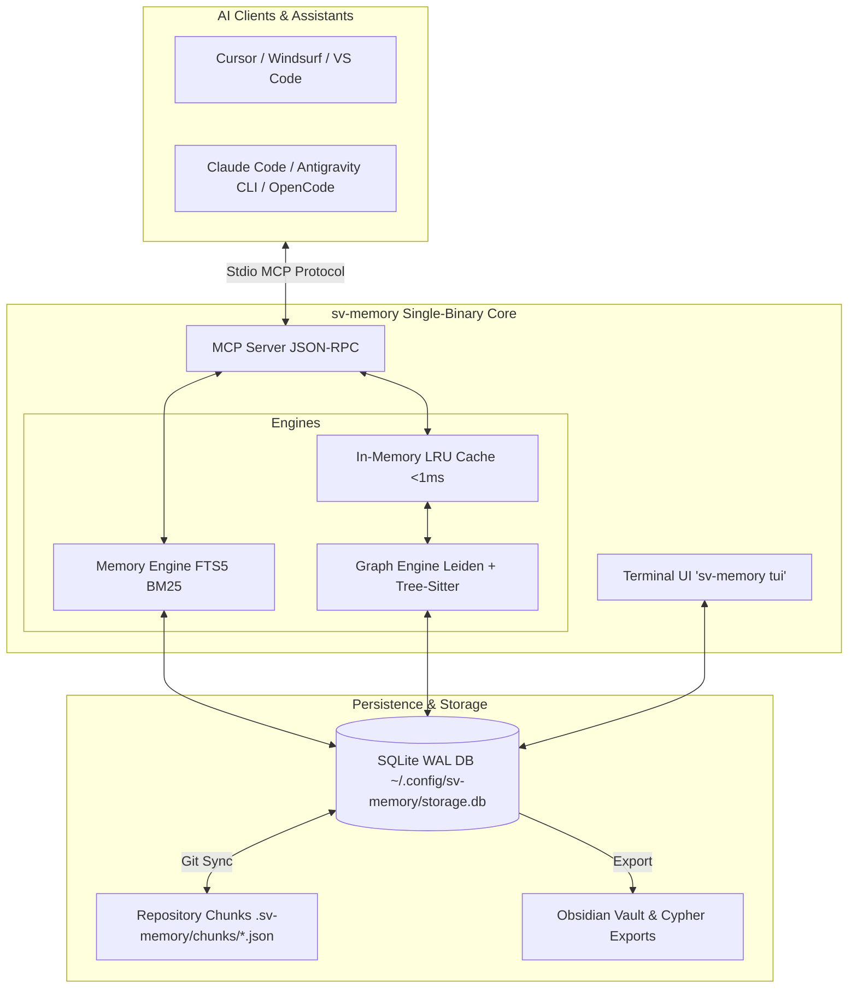

<p align="center">
  
</p>

<h1 align="center">Persistent Memory & Code Graph for AI Agents</h1>

<p align="center">
  <b>Eliminate context amnesia for AI coding agents with persistent decision memories, FTS5 BM25 search, and sub-millisecond structural code graphs.</b>
</p>

<p align="center">
  <a href="LICENSE"></a>
  <a href="https://golang.org/"></a>
  <a href="https://github.com/svtech-code/sv-memory/actions/workflows/ci.yml"></a>
  <a href="https://modelcontextprotocol.io/"></a>
  <a href="https://sqlite.org/"></a>
  <a href="README_ES.md"></a>
</p>

<p align="center">
  <a href="#-key-features">Key Features</a> •
  <a href="#-architecture">Architecture</a> •
  <a href="#-getting-started">Getting Started</a> •
  <a href="#-cli-commands-reference">CLI Commands</a> •
  <a href="#-model-context-protocol-mcp-28-tools">MCP Tools</a> •
  <a href="documentation/getting_started_guide.md">Guide (EN)</a> •
  <a href="documentation/getting_started_guide_ES.md">Guía (ES)</a>
</p>

---

## 📖 Quick Links

> 💡 **New to sv-memory?** Check out the step-by-step [Getting Started & Installation Guide](documentation/getting_started_guide.md) ([Español](documentation/getting_started_guide_ES.md)) or read the [Español README](README_ES.md).

---

## 🚀 Key Features

| Category             | Feature                    | Description                                                                                                                           |
| :------------------- | :------------------------- | :------------------------------------------------------------------------------------------------------------------------------------ |
| 🧠 **Memory**        | **FTS5 BM25 & Scoping**    | SQLite Full-Text Search with BM25 relevance ranking and path-scoped directory filtering.                                              |
| ⚡ **Autonomy**      | **Auto-Boot Context**      | `sv_mem_session_start` delivers previous session summaries, key decisions, and top graph hubs in 1 tool call.                         |
| 🧹 **Maintenance**   | **Auto-Compaction Worker** | `sv_mem_compact` consolidates historical topic key revisions to keep storage ultra-lean.                                              |
| 🕸️ **Graph**         | **Sub-ms LRU Cache**       | Parses 17 languages, Leiden communities, god nodes & bridge nodes with `<1ms` mtime-validated RAM cache.                              |
| 🔍 **Diagnostics**   | **Graph Health Gate**      | `DiagnoseGraph` detects dangling edges, orphan nodes, and unlinked Markdown/SQL AST entities.                                         |
| 🎨 **Interfaces**    | **Interactive TUI**        | Terminal User Interface (`sv-memory tui`) for memory inspection, search, and graph diagnostics.                                       |
| 📦 **Export**        | **Obsidian & Cypher**      | Exports to linked Markdown Obsidian Vaults (`[[wikilinks]]`) and Neo4j / FalkorDB Cypher scripts.                                     |
| 🔄 **Collaboration** | **Git Sync Chunks**        | Git sync via `.sv-memory/chunks/{id}.json` files per memory conflict-free for distinct IDs; same-ID edits surface resolvable markers. |
| 🛡️ **Integration**   | **PreToolUse Hooks**       | Intercepts raw file reads in Claude Code, Antigravity CLI (agy), and OpenCode to query memory first.                                  |

---

## 🛠️ Architecture



---

## 📦 Getting Started

### 1. Installation

**Prebuilt binary (recommended)** a single self-contained binary for macOS, Linux, and Windows:

```bash
# macOS / Linux
curl -fsSL https://raw.githubusercontent.com/svtech-code/sv-memory/main/install.sh | bash

# Windows (PowerShell)
iwr -useb https://raw.githubusercontent.com/svtech-code/sv-memory/main/install.ps1 | iex
```

> The installer verifies the downloaded binary against the release's SHA-256
> `checksums.txt` a mismatched hash aborts the installation.

> On macOS/Linux the binary is installed to `$HOME/.local/bin` (no `sudo` needed).
> On Windows it is installed to `%LOCALAPPDATA%\sv-memory` and added to your user PATH.

**Update to the latest version:**

```bash
sv-memory update
```

This checks GitHub Releases, downloads the binary for your platform, verifies its
SHA-256 checksum, and replaces the running executable. Your memories and configuration
are stored separately and are never affected by an update.

**From source** (pure Go, no CGO required):

```bash
git clone https://github.com/svtech-code/sv-memory.git
cd sv-memory
go build -o sv-memory ./cmd/sv-memory
mv sv-memory ~/.local/bin/
```

### 2. Interactive Setup (`sv-memory configure`)

Configure editors and CLI clients (MCP servers), then grant MCP tool permissions in Phase 4:

```bash
sv-memory configure
```

### 3. Initialize Repository (`sv-memory init`)

Run inside any project directory to register SQLite DB, scan code graph, and inject protocol rules (`AGENTS.md`):

```bash
cd /path/to/your-project
sv-memory init
```

### 4. Install PreToolUse Hooks (`sv-memory hooks install`)

Run inside the project root so agents query memory before reading files:

```bash
cd /path/to/your-project
sv-memory hooks install --platform antigravity
# strict mode: block the first raw file read to force a memory search first
sv-memory hooks install --platform antigravity --strict
```

**Hook modes and degradation:** the hook scripts never call the sv-memory server they are lightweight shell nudges that only inspect local files. **Soft** mode never blocks and always allows the read; **strict** blocks the _first_ file read of each session (per boot/PWD) so the agent must consult `sv_mem_search`/`sv_graph_query` first. Blocking is only implemented where the platform supports it (Antigravity CLI); on Claude Code, strict mode is nudge-only and never blocks. Strict is **fail-open**: if sv-memory is not initialized (no `.sv-memory/`), the binary is missing, or `SV_MEMORY_STRICT_DISABLE=1` is set, the hook allows the read instead of deadlocking the agent.

### 5. Restart the Agent & Verify

Restart your AI assistant, then confirm everything is wired up:

```bash
sv-memory permissions status --platform antigravity   # Granted: 28 / 28
sv-memory hooks status                                # antigravity: ✅ installed
sv-memory diagnose
```

### 6. Interactive Terminal Exploration (`sv-memory tui`)

Browse memories, run BM25 search, check graph health diagnostics, and export notes:

```bash
sv-memory tui
```

---

## 💻 CLI Commands Reference

| Command                            | Category        | Description                                                                              |
| :--------------------------------- | :-------------- | :--------------------------------------------------------------------------------------- |
| `sv-memory init`                   | **Project**     | Initializes repository, scans dependency graph, and injects `AGENTS.md`.                 |
| `sv-memory version`                | **Info**        | Prints the current version, commit hash, and Go runtime.                                 |
| `sv-memory update`                 | **Maintenance** | Checks for new releases, verifies the binary checksum (SHA-256), and auto-updates.       |
| `sv-memory mcp`                    | **Server**      | Launches Model Context Protocol server over stdio for AI clients.                        |
| `sv-memory tui`                    | **Interface**   | Launches interactive terminal user interface for memories and graph diagnostics.         |
| `sv-memory configure`              | **Setup**       | Interactive terminal wizard to configure Cursor, Claude Code, agy, Zed, etc.             |
| `sv-memory configure get/set/list` | **Setup**       | Reads/writes YAML config values globally or project-locally (`--local`).                 |
| `sv-memory sync`                   | **Git Sync**    | Manual bidirectional sync between SQLite DB and `.sv-memory/chunks/*.json`.              |
| `sv-memory diagnose`               | **Diagnostics** | Verifies DB connections, schema integrity, write permissions, and paths.                 |
| `sv-memory stats`                  | **Analytics**   | Displays project memory counts, 24h saves, active sessions, and relations.               |
| `sv-memory export [file]`          | **Export**      | Exports all non-deleted memories of the project to a portable JSON file.                 |
| `sv-memory import <file>`          | **Import**      | Imports memories from a JSON file using upsert by ID.                                    |
| `sv-memory delete session <id>`    | **Maintenance** | Deletes an empty session (fails if it contains memories).                                |
| `sv-memory delete project <id>`    | **Maintenance** | Cascade-deletes a project's data (`--hard` removes it permanently).                      |
| `sv-memory projects list`          | **Project**     | Lists all registered projects with memory/session counts.                                |
| `sv-memory projects prune`         | **Project**     | Removes empty projects from the central registry.                                        |
| `sv-memory projects consolidate`   | **Project**     | Merges a source project's data into a target project, then prunes the source.            |
| `sv-memory graph rebuild`          | **Graph**       | Forces full rescan of codebase files and updates structural graph tables.                |
| `sv-memory graph path <src> <tgt>` | **Graph**       | Finds shortest dependency path between two code nodes (up to 10 hops).                   |
| `sv-memory graph explain <node>`   | **Graph**       | Displays fan-in/fan-out, centrality, and metadata for a symbol or file.                  |
| `sv-memory graph communities`      | **Graph**       | Detects Leiden community clusters, god nodes, and bridge nodes.                          |
| `sv-memory graph wiki`             | **Export**      | Generates Markdown wiki pages per Leiden community.                                      |
| `sv-memory graph viz`              | **Export**      | Generates interactive HTML visualization (`vis.js`).                                     |
| `sv-memory graph merge <a> <b>`    | **Graph**       | Union-merges two project graphs into a JSON snapshot.                                    |
| `sv-memory obsidian-export`        | **Export**      | Exports memories into linked Obsidian Markdown notes (`[[wikilinks]]`).                  |
| `sv-memory conflicts`              | **Memory**      | Detects semantic overlap and memory conflicts across the project.                        |
| `sv-memory hooks install`          | **Hooks**       | Installs PreToolUse hooks for Claude Code, Antigravity CLI, and OpenCode.                |
| `sv-memory permissions list`       | **Permissions** | Lists the 28 sv-memory MCP tools with descriptions.                                      |
| `sv-memory permissions status`     | **Permissions** | Shows granted/missing MCP permissions per platform.                                      |
| `sv-memory permissions grant`      | **Permissions** | Writes MCP tool allow-lists (`--all`/`--tool`, `--dry-run`) for Antigravity/Claude Code. |
| `sv-memory permissions revoke`     | **Permissions** | Removes sv-memory allow-list entries, preserving unrelated permissions.                  |

---

## 🧩 Model Context Protocol (MCP) 28 Tools

### 🧠 Memory Tools

- **`sv_mem_save`**: Persists architectural decisions, bugfixes, or standards with auto Git sync, and links the memory to its code node in the dependency graph when a `where_path` is provided.
- **`sv_mem_update`**: Partially updates an existing memory by ID (keeps identity, advances revision).
- **`sv_mem_search`**: FTS5 search with **BM25 ranking**, category/path filters, and **match_mode** (`all` / `any`).
- **`sv_mem_get`**: Retrieves full content of a specific memory with optional truncation.
- **`sv_mem_timeline`**: Chronological context around a memory (Layer 2 progressive disclosure).
- **`sv_mem_suggest_topic_key`**: Generates stable `category/kebab-case` topic key for upsert.
- **`sv_mem_judge`**: Creates relations between memories (`supersedes`, `conflicts_with`, `relates_to`).
- **`sv_mem_compare`**: Side-by-side comparison of two memories.
- **`sv_mem_review`**: Lists stale, duplicate, or consolidation candidates; `action="mark_reviewed"` resets a memory's policy-review deadline.
- **`sv_mem_stats`**: Aggregate memory statistics and per-category breakdowns, plus the current active project (ID, name, path).
- **`sv_mem_diagnose`**: Runs read-only health checks (database, FTS5, project, and graph integrity).
- **`sv_mem_delete`**: Soft-deletes (or hard-deletes) a memory.
- **`sv_mem_pin`**: Pins a local memory so it surfaces first in session context; `action="unpin"` clears it.
- **`sv_mem_capture_passive`**: Logs lightweight journal entries automatically.
- **`sv_mem_conflicts`**: Surfaces memory conflicts with semantic overlap analysis; `action=scan semantic=true` LLM-judges candidate pairs via the agent CLI (claude/opencode).
- **`sv_mem_compact`**: Consolidates historical topic key revisions into unified summary records.

### ⏱️ Session Tools

- **`sv_mem_session_start`**: Registers coding session and delivers **Auto-Boot Context Bundle**.
- **`sv_mem_session_end`**: Closes active session with summary.
- **`sv_mem_session_summary`**: Updates session goal, discoveries, accomplished, and next steps.
- **`sv_mem_context`**: Recovers context from the last completed session.

### 🕸️ Graph Tools

- **`sv_graph_query`**: BFS dependency query with sub-millisecond LRU cache. Returns Mermaid diagram.
- **`sv_graph_path`**: Shortest dependency path between two nodes.
- **`sv_graph_sync`**: Incrementally syncs dependency graph from file changes.
- **`sv_graph_explain`**: Detailed node information with fan-in/fan-out metrics and actionable refactor suggestions.
- **`sv_graph_god_nodes`**: Identifies highly-connected hub nodes.
- **`sv_graph_surprising_connections`**: Finds unexpected or non-obvious dependencies with bridge-score highlights.
- **`sv_graph_viz`**: Generates interactive HTML visualization (`vis.js`).
- **`sv_graph_merge`**: Union-merges two project graphs by node ID into a JSON snapshot.

---

## ⚙️ AI Client Configuration Examples

### Cursor / Claude Desktop / Windsurf

Add the following snippet to your client's MCP configuration JSON:

```json
{
  "mcpServers": {
    "sv-memory": {
      "command": "~/.local/bin/sv-memory",
      "args": ["mcp"]
    }
  }
}
```

> Use the full path to your installed binary: `~/.local/bin/sv-memory` on macOS/Linux,
> or `%LOCALAPPDATA%\sv-memory\sv-memory.exe` on Windows.

### Granting MCP Tool Permissions

Some agents (Antigravity CLI, Claude Code) use a static allow-list and prompt for
approval on every unlisted MCP tool call. `sv-memory` can manage that allow-list
for you, either from the `configure` wizard (Phase 4) or standalone:

```bash
# Show the 28 tools with descriptions
sv-memory permissions list

# Grant all 28 tools to Antigravity CLI (dry-run first to preview)
sv-memory permissions grant --platform antigravity --all --dry-run
sv-memory permissions grant --platform antigravity --all

# Grant a subset
sv-memory permissions grant --platform claude-code --tool sv_mem_search,sv_mem_get

# Inspect state, then revoke if needed
sv-memory permissions status
sv-memory permissions revoke --platform antigravity
```

- **Antigravity** writes `mcp(sv-memory/<tool>)` entries into `~/.gemini/antigravity-cli/settings.json`.
- **Claude Code** writes `mcp__sv-memory__<tool>` entries into `~/.claude/settings.json`.
- **OpenCode** and **Codex** use interactive approval and are skipped (no static allow-list).
- Unrelated entries (e.g. `command(npm run)`) are always preserved.
- Restart your AI assistant after granting to load the new permissions.

In the `sv-memory configure` wizard, **Phase 4** lists the 28 tools for you to choose
which to authorize (press `a` to select all and `x` to select none) on the configured
platforms.

---

## 🔄 Git Sync & Merge Conflicts

sv-memory syncs your SQLite store (local per clone) with `.sv-memory/chunks/{id}.json`
files committed to Git, so a team shares architectural context across clones. Because
each memory lives in its own file, agents editing **different** memories never conflict.

**Same-memory edits are _not_ zero-conflict.** When two clones edit the _same_ memory
ID (typically via topic-key upserts), Git produces conflict markers inside `{id}.json`:

```json
<<<<<<< HEAD
{ "id": "abc123", "what": "my local change" }
=======
{ "id": "abc123", "what": "their change" }
>>>>>>> remote
```

What happens on `sv-memory sync` / auto-import:

- A chunk with unresolved conflict markers (or any unparseable JSON) is **skipped with
  a warning**; the rest of the chunks still import. It does **not** abort the whole sync.
- When a pulled chunk would overwrite a local version that is **newer** (higher
  `revision_count`) or **diverged at the same revision**, a last-writer-wins warning is
  logged the git chunk wins, but the lost local edit is surfaced instead of silently
  dropped.

To resolve a conflicted chunk: edit `{id}.json` to the desired content (removing the
`<<<<<<<`/`=======`/`>>>>>>>` markers), `git add` it, and re-run `sv-memory sync`.
Run `sv-memory sync` after `git pull`/`git merge` so the server picks up team changes.

---

## 🔐 Secret Hygiene

sv-memory is designed not to persist credentials, API keys, or `.env` contents.

- **Secret redaction:** every memory text field is scanned by `SanitizeText` (OpenAI `sk-…`,
  Anthropic `sk-ant-…`, Google `AIzaSy…`, JWTs, PEM/private keys, DB connection strings, and
  generic `password=…`/`token=…` assignments) **before** being written to SQLite on the
  normal save path, on imports (`sv-memory import`, git chunk sync), and on session summaries.
  The redaction is re-applied on read and on every export so sanitized values stay sanitized.
- **Graph:** `.env`, `*.pem`, `*.key`, `id_rsa`, and `credentials` files are never indexed
  (not in the scanned extensions), and the default `.sv-memoryignore` also excludes them plus
  `.ssh/`, `.aws/`, `.gcp/`, and `secrets.yaml`. Content-derived graph text (markdown
  headings, `TODO:`/`WHY:` comments, SQL defaults) is redacted before persistence.
- **Storage:** the SQLite database lives outside the repo (`~/.config/sv-memory/storage.db` by
  default) and `.gitignore` covers `*.db`/`*.sqlite`; only the per-memory chunk JSON (already
  redacted) is committed to Git for team sharing.
- **Defense in depth:** because the graph indexes `.md`/`.sql` files (which can embed secrets),
  keep `SECRETS.md` and similar files out of the graph by adding them to `.sv-memoryignore`.
- **Local tools:** the MCP server speaks stdio only (no network), project IDs are hashed, and
  all SQL is parameterized; no shell is ever invoked with interpolated user input.

---

## 📄 License

Developed under the **SVTech** ecosystem. Released under the [MIT License](LICENSE).
