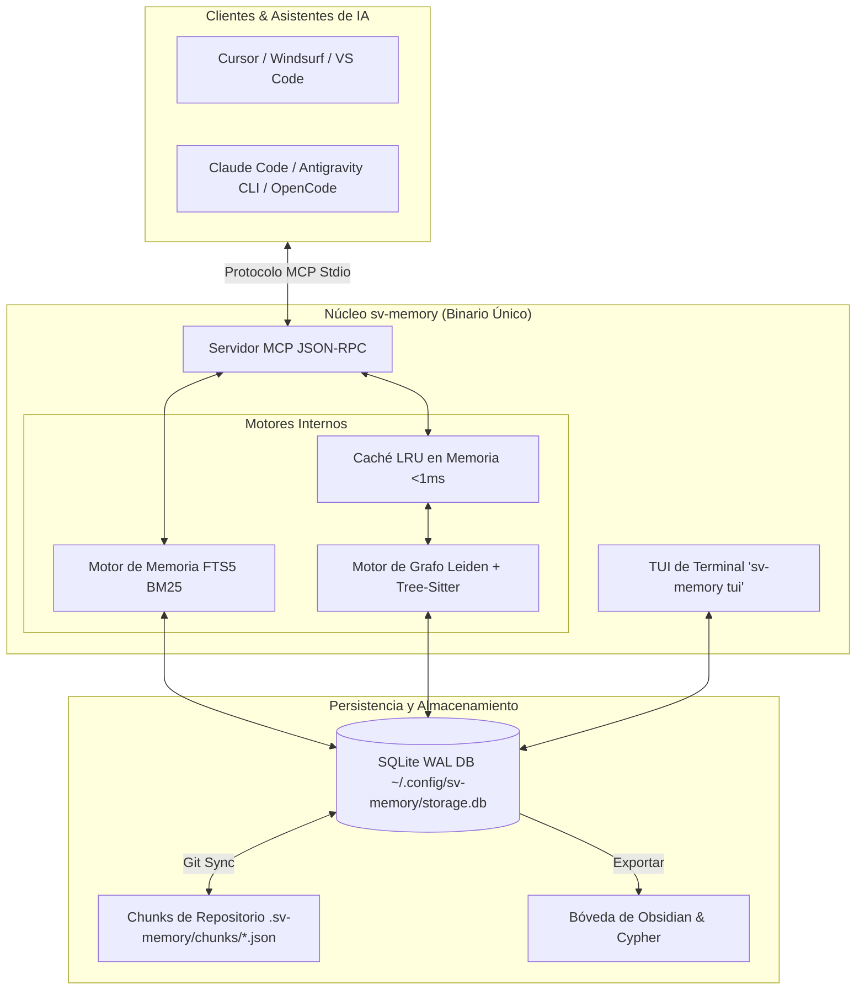

<p align="center">
  
</p>

<h1 align="center">sv-memory — Memoria Persistente y Grafo de Código para Agentes de IA</h1>

<p align="center">
  <b>Elimina la amnesia de contexto en agentes de IA con memoria persistente de decisiones, búsqueda FTS5 BM25 y grafos de código sub-milisegundo.</b>
</p>

<p align="center">
  <a href="LICENSE"></a>
  <a href="https://golang.org/"></a>
  <a href="https://modelcontextprotocol.io/"></a>
  <a href="https://sqlite.org/"></a>
  <a href="README.md"></a>
</p>

<p align="center">
  <a href="#-características-clave">Características</a> •
  <a href="#-arquitectura">Arquitectura</a> •
  <a href="#-inicio-rápido">Inicio Rápido</a> •
  <a href="#-referencia-de-comandos-cli">Comandos CLI</a> •
  <a href="#-herramientas-del-model-context-protocol-mcp-26-herramientas">Herramientas MCP</a> •
  <a href="documentation/getting_started_guide.md">Guía</a>
</p>

---

## 📖 Enlaces Rápidos

> 💡 **¿Nuevo en sv-memory?** Revisa la [Guía Completa de Inicio e Instalación](documentation/getting_started_guide.md) paso a paso o la versión en [Inglés (README.md)](README.md).

---

## 🚀 Características Clave

| Categoría            | Característica             | Descripción                                                                                                             |
| :------------------- | :------------------------- | :---------------------------------------------------------------------------------------------------------------------- |
| 🧠 **Memoria**       | **FTS5 BM25 & Scoping**    | Búsqueda de texto completo SQLite con clasificación BM25 y filtrado restringido por subdirectorio.                      |
| ⚡ **Autonomía**     | **Auto-Boot Context**      | `sv_mem_session_start` entrega el resumen de la sesión anterior y decisiones clave en 1 sola llamada.                   |
| 🧹 **Mantenimiento** | **Auto-Compaction Worker** | `sv_mem_compact` consolida revisiones históricas de topic keys para mantener la BD liviana.                             |
| 🕸️ **Grafo**         | **Caché LRU Sub-ms**       | Parsea +15 lenguajes, comunidades Leiden, nodos god y nodos puente con caché RAM `<1ms` validado por mtime.             |
| 🔍 **Diagnóstico**   | **Diagnóstico de Grafo**   | `DiagnoseGraph` detecta enlaces rotos, nodos huérfanos y entidades AST no vinculadas.                                   |
| 🎨 **Interfaz**      | **TUI Interactiva**        | Interfaz de Usuario en Terminal (`sv-memory tui`) para inspección, búsqueda BM25 y diagnósticos.                        |
| 📦 **Exportación**   | **Obsidian & Cypher**      | Exporta a notas Markdown vinculadas de Obsidian (`[[wikilinks]]`) y scripts Cypher para Neo4j / FalkorDB.               |
| 🔄 **Colaboración**  | **Git Sync Chunks**        | Sincronización Git sin conflictos mediante archivos `.sv-memory/chunks/{id}.json` por memoria.                          |
| 🛡️ **Integración**   | **Hooks PreToolUse**       | Intercepta lecturas raw de archivos en Claude Code, Antigravity CLI (agy) y OpenCode para consultar la memoria primero. |

---

## 🛠️ Arquitectura



---

## 📦 Inicio Rápido

### 1. Instalación (Binario Global)

Compilación en Go puro (sin requerir CGO):

```bash
git clone https://github.com/svtech/sv-memory.git
cd sv-memory
go build -o sv-memory ./cmd/sv-memory
sudo mv sv-memory /usr/local/bin/
```

### 2. Configuración Interactiva (`sv-memory configure`)

Configura editores, clientes CLI y hooks PreToolUse de manera automática:

```bash
sv-memory configure
```

### 3. Inicializar Repositorio (`sv-memory init`)

Ejecuta dentro de cualquier directorio de proyecto para registrar la BD SQLite, escanear el grafo e inyectar reglas (`AGENTS.md`):

```bash
cd /ruta/a/tu-proyecto
sv-memory init
```

### 4. Exploración Interactiva en Terminal (`sv-memory tui`)

Navega memorias, busca con BM25, revisa diagnósticos de salud del grafo y exporta notas:

```bash
sv-memory tui
```

---

## 💻 Referencia de Comandos CLI

| Comando                            | Categoría       | Descripción                                                                             |
| :--------------------------------- | :-------------- | :-------------------------------------------------------------------------------------- |
| `sv-memory init`                   | **Proyecto**    | Inicializa el repositorio, escanea el grafo de dependencias e inyecta `AGENTS.md`.      |
| `sv-memory mcp`                    | **Servidor**    | Inicia el servidor Model Context Protocol sobre stdio para clientes de IA.              |
| `sv-memory tui`                    | **Interfaz**    | Inicia la interfaz interactiva de terminal para explorar memorias y diagnósticos.       |
| `sv-memory configure`              | **Instalación** | Asistente interactivo en terminal para configurar Cursor, Claude Code, agy, Zed, etc.   |
| `sv-memory sync`                   | **Git Sync**    | Sincronización bidireccional entre la BD SQLite y `.sv-memory/chunks/*.json`.           |
| `sv-memory diagnose`               | **Diagnóstico** | Verifica conexiones SQLite, integridad de esquema, permisos de escritura y rutas.       |
| `sv-memory stats`                  | **Analítica**   | Muestra conteos de memorias, guardados en 24h, sesiones activas y relaciones.           |
| `sv-memory graph rebuild`          | **Grafo**       | Fuerza un re-escaneo completo del árbol de archivos y actualiza las tablas del grafo.   |
| `sv-memory graph path <src> <tgt>` | **Grafo**       | Encuentra la ruta de dependencia más corta entre dos nodos de código (hasta 10 saltos). |
| `sv-memory graph explain <nodo>`   | **Grafo**       | Muestra fan-in/fan-out, centralidad y metadatos de un símbolo o archivo.                |
| `sv-memory graph communities`      | **Grafo**       | Detecta comunidades Leiden, nodos god y nodos puente.                                   |
| `sv-memory graph wiki`             | **Exportación** | Genera páginas wiki en Markdown por cada comunidad Leiden.                              |
| `sv-memory graph viz`              | **Exportación** | Genera una visualización HTML interactiva (`vis.js`).                                   |
| `sv-memory obsidian-export`        | **Exportación** | Exporta memorias a una bóveda de notas Markdown de Obsidian (`[[wikilinks]]`).          |
| `sv-memory conflicts`              | **Memoria**     | Detecta superposiciones semánticas y conflictos entre memorias del proyecto.            |
| `sv-memory hooks install`          | **Hooks**       | Instala hooks PreToolUse para Claude Code, Antigravity CLI y OpenCode.                  |

---

## 🧩 Herramientas del Model Context Protocol (MCP) (26 Herramientas)

### 🧠 Herramientas de Memoria

- **`sv_mem_save`**: Guarda decisiones arquitectónicas, correcciones o estándares con Git sync automático.
- **`sv_mem_search`**: Búsqueda FTS5 con **clasificación BM25**, filtros por categoría y **path-scoping**.
- **`sv_mem_get`**: Recupera el contenido completo de una memoria específica con truncamiento opcional.
- **`sv_mem_timeline`**: Contexto cronológico alrededor de una memoria (Capa 2 de divulgación progresiva).
- **`sv_mem_suggest_topic_key`**: Genera un topic_key estable en formato `category/kebab-case` para upsert.
- **`sv_mem_judge`**: Crea relaciones entre memorias (`supersedes`, `conflicts_with`, `relates_to`).
- **`sv_mem_compare`**: Comparación lado a lado de dos memorias.
- **`sv_mem_review`**: Encuentra memorias obsoletas, duplicadas o candidatas a consolidación.
- **`sv_mem_stats`**: Estadísticas agregadas de memorias y desglose por categoría.
- **`sv_mem_current_project`**: Recupera el ID, nombre y ruta del proyecto activo.
- **`sv_mem_delete`**: Soft-delete (o hard-delete) de una memoria.
- **`sv_mem_capture_passive`**: Registra entradas de diario ligeras automáticamente.
- **`sv_mem_conflicts`**: Muestra conflictos de memoria con análisis de superposición semántica.
- **`sv_mem_compact`**: Consolida revisiones históricas de topic keys en registros de síntesis unificados.

### ⏱️ Herramientas de Sesión

- **`sv_mem_session_start`**: Registra sesión de codificación y entrega el **Paquete de Arranque Auto-Boot**.
- **`sv_mem_session_end`**: Cierra sesión activa con resumen.
- **`sv_mem_session_summary`**: Actualiza objetivo, descubrimientos, metas cumplidas y siguientes pasos.
- **`sv_mem_context`**: Recupera contexto de la última sesión completada.

### 🕸️ Herramientas de Grafo

- **`sv_graph_query`**: Consulta BFS de dependencias con caché LRU sub-milisegundo. Devuelve diagrama Mermaid.
- **`sv_graph_path`**: Ruta de dependencia más corta entre dos nodos.
- **`sv_graph_sync`**: Sincronización incremental del grafo desde cambios de archivos.
- **`sv_graph_explain`**: Información detallada de un nodo con métricas fan-in/fan-out.
- **`sv_graph_god_nodes`**: Identifica nodos centralizados / altamente conectados.
- **`sv_graph_surprising_connections`**: Encuentra dependencias inesperadas o no obvias.
- **`sv_graph_viz`**: Genera visualización HTML interactiva (`vis.js`).
- **`sv_graph_merge`**: Fusiona una instantánea JSON del grafo en el grafo actual.

---

## ⚙️ Configuración en Clientes de IA

### Cursor / Claude Desktop / Windsurf

Añade el siguiente fragmento al archivo JSON de configuración MCP de tu cliente:

```json
{
  "mcpServers": {
    "sv-memory": {
      "command": "/usr/local/bin/sv-memory",
      "args": ["mcp"]
    }
  }
}
```

---

## 📄 Licencia

Desarrollado bajo el ecosistema de **SVTech**. Publicado bajo la [Licencia MIT](LICENSE).
