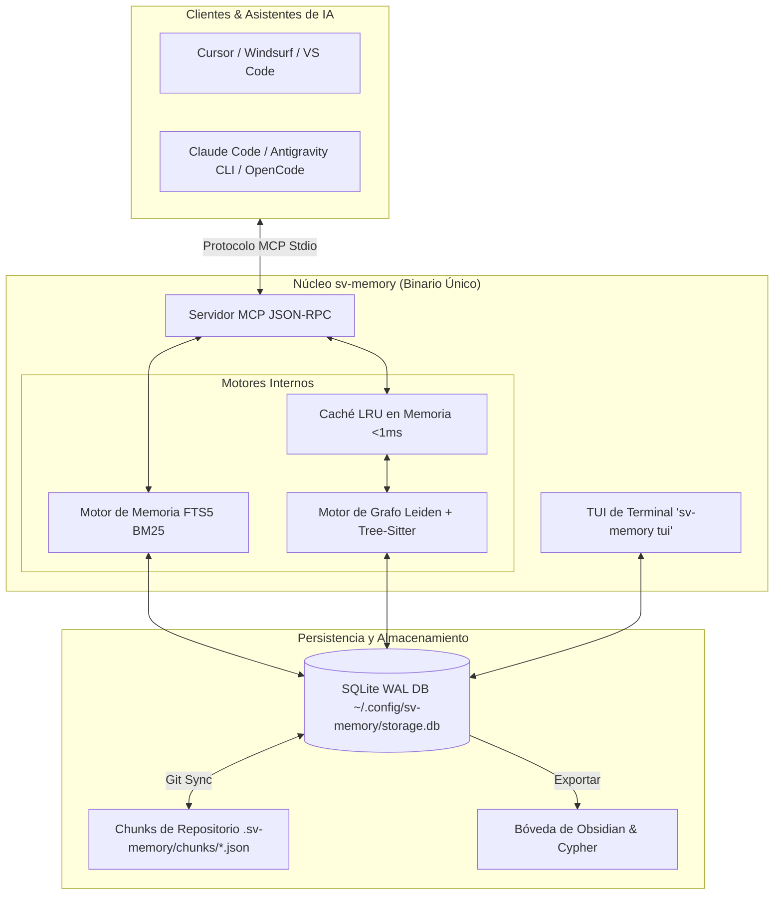

<p align="center">
  
</p>

<h1 align="center">Memoria Persistente y Grafo de Código para Agentes de IA</h1>

<p align="center">
  <b>Elimina la amnesia de contexto en agentes de IA con memoria persistente de decisiones, búsqueda FTS5 BM25 y grafos de código sub-milisegundo.</b>
</p>

<p align="center">
  <a href="LICENSE"></a>
  <a href="https://golang.org/"></a>
  <a href="https://github.com/svtech-code/sv-memory/actions/workflows/ci.yml"></a>
  <a href="https://modelcontextprotocol.io/"></a>
  <a href="https://sqlite.org/"></a>
  <a href="README.md"></a>
</p>

<p align="center">
  <a href="#-características-clave">Características</a> •
  <a href="#-arquitectura">Arquitectura</a> •
  <a href="#-inicio-rápido">Inicio Rápido</a> •
  <a href="#-referencia-de-comandos-cli">Comandos CLI</a> •
  <a href="#-herramientas-mcp-30-herramientas">Herramientas MCP</a> •
  <a href="documentation/getting_started_guide_ES.md">Guía (ES)</a> •
  <a href="documentation/getting_started_guide.md">Guide (EN)</a>
</p>

---

## 📖 Enlaces Rápidos

> 💡 **¿Nuevo en sv-memory?** Revisa la [Guía Completa de Inicio e Instalación](documentation/getting_started_guide_ES.md) paso a paso ([English](documentation/getting_started_guide.md)) o la versión en [Inglés (README.md)](README.md).

---

## 🚀 Características Clave

| Categoría            | Característica             | Descripción                                                                                                             |
| :------------------- | :------------------------- | :---------------------------------------------------------------------------------------------------------------------- |
| 🧠 **Memoria**       | **FTS5 BM25 & Scoping**    | Búsqueda de texto completo SQLite con clasificación BM25 y filtrado restringido por subdirectorio.                      |
| ⚡ **Autonomía**     | **Auto-Boot Context**      | `sv_mem_session_start` entrega el resumen de la sesión anterior, decisiones clave y hubs del grafo en 1 sola llamada.   |
| 🧹 **Mantenimiento** | **Auto-Compaction Worker** | `sv_mem_compact` consolida revisiones históricas de topic keys para mantener la BD liviana.                             |
| 🕸️ **Grafo**         | **Caché LRU Sub-ms**       | Parsea 17 lenguajes, comunidades Leiden, nodos god y nodos puente con caché RAM `<1ms` validado por mtime.             |
| 🔍 **Diagnóstico**   | **Diagnóstico de Grafo**   | `DiagnoseGraph` detecta enlaces rotos, nodos huérfanos y entidades AST no vinculadas.                                   |
| 🎨 **Interfaz**      | **TUI Interactiva**        | Interfaz de Usuario en Terminal (`sv-memory tui`) para inspección, búsqueda BM25 y diagnósticos.                        |
| 📦 **Exportación**   | **Obsidian & Cypher**      | Exporta a notas Markdown vinculadas de Obsidian (`[[wikilinks]]`) y scripts Cypher para Neo4j / FalkorDB.               |
| 🔄 **Colaboración**  | **Git Sync Chunks**        | Sincronización Git sin conflictos mediante archivos `.sv-memory/chunks/{id}.json` por memoria.                          |
| 🛡️ **Integración**   | **Hooks PreToolUse**       | Intercepta lecturas raw de archivos en Claude Code, Antigravity CLI (agy) y OpenCode para consultar la memoria primero. |

---

## 🛠️ Arquitectura



---

## 📦 Inicio Rápido

### 1. Instalación

**Binario precompilado (recomendado)** — un único binario autocontenido para macOS, Linux y Windows:

```bash
# macOS / Linux
curl -fsSL https://raw.githubusercontent.com/svtech-code/sv-memory/main/install.sh | bash

# Windows (PowerShell)
iwr -useb https://raw.githubusercontent.com/svtech-code/sv-memory/main/install.ps1 | iex
```

> El instalador verifica el binario descargado contra el `checksums.txt` SHA-256
> de la release — un hash que no coincida aborta la instalación.

> En macOS/Linux el binario se instala en `$HOME/.local/bin` (sin `sudo`).
> En Windows se instala en `%LOCALAPPDATA%\sv-memory` y se agrega al PATH del usuario.

**Actualizar a la última versión:**

```bash
sv-memory update
```

Esto busca la última release de GitHub, descarga el binario para tu plataforma, verifica su
checksum SHA-256 y reemplaza el ejecutable en uso. Tus memorias y configuración se guardan
por separado y nunca se ven afectadas por una actualización.

**Desde el código fuente** (Go puro, sin requerir CGO):

```bash
git clone https://github.com/svtech-code/sv-memory.git
cd sv-memory
go build -o sv-memory ./cmd/sv-memory
mv sv-memory ~/.local/bin/
```

### 2. Configuración Interactiva (`sv-memory configure`)

Configura editores y clientes CLI (servidores MCP) y otorga permisos de las herramientas MCP en la Fase 4:

```bash
sv-memory configure
```

### 3. Inicializar Repositorio (`sv-memory init`)

Ejecuta dentro de cualquier directorio de proyecto para registrar la BD SQLite, escanear el grafo e inyectar reglas (`AGENTS.md`):

```bash
cd /ruta/a/tu-proyecto
sv-memory init
```

### 4. Instalar Hooks PreToolUse (`sv-memory hooks install`)

Ejecuta dentro de la raíz del proyecto para que los agentes consulten la memoria antes de leer archivos:

```bash
cd /ruta/a/tu-proyecto
sv-memory hooks install --platform antigravity
# modo strict: bloquea la primera lectura raw para forzar la búsqueda en memoria
sv-memory hooks install --platform antigravity --strict
```

### 5. Reiniciar el Agente y Verificar

Reinicia tu asistente de IA y confirma que todo quedó conectado:

```bash
sv-memory permissions status --platform antigravity   # Granted: 30 / 30
sv-memory hooks status                                # antigravity: ✅ installed
sv-memory diagnose
```

### 6. Exploración Interactiva en Terminal (`sv-memory tui`)

Navega memorias, busca con BM25, revisa diagnósticos de salud del grafo y exporta notas:

```bash
sv-memory tui
```

---

## 💻 Referencia de Comandos CLI

| Comando                            | Categoría       | Descripción                                                                                           |
| :--------------------------------- | :-------------- | :---------------------------------------------------------------------------------------------------- |
| `sv-memory init`                   | **Proyecto**    | Inicializa el repositorio, escanea el grafo de dependencias e inyecta `AGENTS.md`.                    |
| `sv-memory version`                | **Información** | Muestra la versión actual, el hash del commit y el runtime de Go.                                    |
| `sv-memory update`                 | **Mantenimiento** | Busca nuevas releases, verifica el checksum del binario (SHA-256) y se auto-actualiza.              |
| `sv-memory mcp`                    | **Servidor**    | Inicia el servidor Model Context Protocol sobre stdio para clientes de IA.                            |
| `sv-memory tui`                    | **Interfaz**    | Inicia la interfaz interactiva de terminal para explorar memorias y diagnósticos.                     |
| `sv-memory configure`              | **Instalación** | Asistente interactivo en terminal para configurar Cursor, Claude Code, agy, Zed, etc.                 |
| `sv-memory configure get/set/list` | **Instalación** | Lee/escribe valores de configuración YAML global o por proyecto (`--local`).                          |
| `sv-memory sync`                   | **Git Sync**    | Sincronización bidireccional entre la BD SQLite y `.sv-memory/chunks/*.json`.                         |
| `sv-memory diagnose`               | **Diagnóstico** | Verifica conexiones SQLite, integridad de esquema, permisos de escritura y rutas.                     |
| `sv-memory stats`                  | **Analítica**   | Muestra conteos de memorias, guardados en 24h, sesiones activas y relaciones.                         |
| `sv-memory export [archivo]`       | **Exportación** | Exporta las memorias no eliminadas del proyecto a un archivo JSON portátil.                           |
| `sv-memory import <archivo>`       | **Importación** | Importa memorias desde un archivo JSON usando upsert por ID.                                          |
| `sv-memory delete session <id>`    | **Mantenimiento** | Elimina una sesión vacía (falla si contiene memorias).                                              |
| `sv-memory delete project <id>`    | **Mantenimiento** | Elimina en cascada los datos de un proyecto (`--hard` los borra permanentemente).                    |
| `sv-memory projects list`          | **Proyecto**    | Lista todos los proyectos registrados con conteos de memorias/sesiones.                              |
| `sv-memory projects prune`         | **Proyecto**    | Elimina proyectos vacíos del registro central.                                                       |
| `sv-memory projects consolidate`   | **Proyecto**    | Fusiona los datos de un proyecto origen en uno destino y luego limpia el origen.                     |
| `sv-memory graph rebuild`          | **Grafo**       | Fuerza un re-escaneo completo del árbol de archivos y actualiza las tablas del grafo.                 |
| `sv-memory graph path <src> <tgt>` | **Grafo**       | Encuentra la ruta de dependencia más corta entre dos nodos de código (hasta 10 saltos).               |
| `sv-memory graph explain <nodo>`   | **Grafo**       | Muestra fan-in/fan-out, centralidad y metadatos de un símbolo o archivo.                              |
| `sv-memory graph communities`      | **Grafo**       | Detecta comunidades Leiden, nodos god y nodos puente.                                                 |
| `sv-memory graph wiki`             | **Exportación** | Genera páginas wiki en Markdown por cada comunidad Leiden.                                            |
| `sv-memory graph viz`              | **Exportación** | Genera una visualización HTML interactiva (`vis.js`).                                                 |
| `sv-memory graph merge <a> <b>`    | **Grafo**       | Union-merge de dos grafos de proyecto en un snapshot JSON.                                            |
| `sv-memory obsidian-export`        | **Exportación** | Exporta memorias a una bóveda de notas Markdown de Obsidian (`[[wikilinks]]`).                        |
| `sv-memory conflicts`              | **Memoria**     | Detecta superposiciones semánticas y conflictos entre memorias del proyecto.                          |
| `sv-memory hooks install`          | **Hooks**       | Instala hooks PreToolUse para Claude Code, Antigravity CLI y OpenCode.                                |
| `sv-memory permissions list`       | **Permisos**    | Lista las 30 herramientas MCP de sv-memory con descripciones.                                         |
| `sv-memory permissions status`     | **Permisos**    | Muestra permisos MCP otorgados/faltantes por plataforma.                                              |
| `sv-memory permissions grant`      | **Permisos**    | Escribe allow-lists de herramientas MCP (`--all`/`--tool`, `--dry-run`) para Antigravity/Claude Code. |
| `sv-memory permissions revoke`     | **Permisos**    | Elimina entradas de sv-memory de la allow-list conservando permisos no relacionados.                  |

---

## 🧩 Herramientas MCP (30 Herramientas)

### 🧠 Herramientas de Memoria

- **`sv_mem_save`**: Guarda decisiones arquitectónicas, correcciones o estándares con Git sync automático, y enlaza la memoria a su nodo de código en el grafo de dependencias cuando se proporciona un `where_path`.
- **`sv_mem_update`**: Actualiza parcialmente una memoria existente por ID (conserva la identidad, avanza la revisión).
- **`sv_mem_search`**: Búsqueda FTS5 con **clasificación BM25**, filtros por categoría/ruta y **match_mode** (`all` / `any`).
- **`sv_mem_get`**: Recupera el contenido completo de una memoria específica con truncamiento opcional.
- **`sv_mem_timeline`**: Contexto cronológico alrededor de una memoria (Capa 2 de divulgación progresiva).
- **`sv_mem_suggest_topic_key`**: Genera un topic_key estable en formato `category/kebab-case` para upsert.
- **`sv_mem_judge`**: Crea relaciones entre memorias (`supersedes`, `conflicts_with`, `relates_to`).
- **`sv_mem_compare`**: Comparación lado a lado de dos memorias.
- **`sv_mem_review`**: Lista memorias obsoletas, duplicadas o candidatas a consolidación; `action="mark_reviewed"` reinicia el plazo de revisión de política de una memoria.
- **`sv_mem_stats`**: Estadísticas agregadas de memorias y desglose por categoría, más el proyecto activo actual (ID, nombre y ruta).
- **`sv_mem_diagnose`**: Ejecuta chequeos de salud de solo lectura (base de datos, FTS5, proyecto e integridad del grafo).
- **`sv_mem_delete`**: Soft-delete (o hard-delete) de una memoria.
- **`sv_mem_pin`**: Fija una memoria local para que aparezca primero en el contexto de sesión; `action="unpin"` la desfija.
- **`sv_mem_capture_passive`**: Registra entradas de diario ligeras automáticamente.
- **`sv_mem_conflicts`**: Muestra conflictos de memoria con análisis de superposición semántica; `action=scan semantic=true` juzga los pares candidatos con LLM vía el CLI del agente (claude/opencode).
- **`sv_mem_compact`**: Consolida revisiones históricas de topic keys en registros de síntesis unificados.

### ⏱️ Herramientas de Sesión

- **`sv_mem_session_start`**: Registra sesión de codificación y entrega el **Paquete de Arranque Auto-Boot**.
- **`sv_mem_session_end`**: Cierra sesión activa con resumen.
- **`sv_mem_session_summary`**: Actualiza objetivo, descubrimientos, metas cumplidas y siguientes pasos.
- **`sv_mem_context`**: Recupera contexto de la última sesión completada.

### 🕸️ Herramientas de Grafo

- **`sv_graph_query`**: Consulta BFS de dependencias con caché LRU sub-milisegundo. Devuelve diagrama Mermaid.
- **`sv_graph_path`**: Ruta de dependencia más corta entre dos nodos.
- **`sv_graph_sync`**: Sincronización incremental del grafo desde cambios de archivos.
- **`sv_graph_explain`**: Información detallada de un nodo con métricas fan-in/fan-out y sugerencias accionables de refactor.
- **`sv_graph_god_nodes`**: Identifica nodos centralizados / altamente conectados.
- **`sv_graph_surprising_connections`**: Encuentra dependencias inesperadas o no obvias con resaltado de bridge score.
- **`sv_graph_viz`**: Genera visualización HTML interactiva (`vis.js`).
- **`sv_graph_merge`**: Union-merge de dos grafos de proyecto por ID de nodo en un snapshot JSON.

---

## ⚙️ Configuración en Clientes de IA

### Cursor / Claude Desktop / Windsurf

Añade el siguiente fragmento al archivo JSON de configuración MCP de tu cliente:

```json
{
  "mcpServers": {
    "sv-memory": {
      "command": "~/.local/bin/sv-memory",
      "args": ["mcp"]
    }
  }
}
```

### Otorgar permisos a las herramientas MCP

Algunos agentes (Antigravity CLI, Claude Code) usan una allow-list estática y piden
aprobación en cada llamada a una herramienta MCP no listada. `sv-memory` puede
gestionar esa allow-list automáticamente, ya sea desde el asistente `configure`
(Fase 4) o de forma independiente:

```bash
# Muestra las 30 herramientas con descripciones
sv-memory permissions list

# Otorga las 30 herramientas a Antigravity CLI (usa --dry-run primero para previsualizar)
sv-memory permissions grant --platform antigravity --all --dry-run
sv-memory permissions grant --platform antigravity --all

# Otorga un subconjunto
sv-memory permissions grant --platform claude-code --tool sv_mem_search,sv_mem_get

# Inspecciona el estado y revoca si es necesario
sv-memory permissions status
sv-memory permissions revoke --platform antigravity
```

- **Antigravity** escribe entradas `mcp(sv-memory/<tool>)` en `~/.gemini/antigravity-cli/settings.json`.
- **Claude Code** escribe entradas `mcp__sv-memory__<tool>` en `~/.claude/settings.json`.
- **OpenCode** y **Codex** usan aprobación interactiva y se omiten (sin allow-list estática).
- Las entradas no relacionadas (p. ej. `command(npm run)`) siempre se conservan.
- Reinicia tu asistente de IA tras otorgar permisos para que cargue los cambios.

En el asistente `sv-memory configure`, la **Fase 4** lista las 30 herramientas para que
selecciones cuáles autorizar (con `a` seleccionas todas y `x` ninguna) en las plataformas
configuradas.

---

## 📄 Licencia

Desarrollado bajo el ecosistema de **SVTech**. Publicado bajo la [Licencia MIT](LICENSE).
