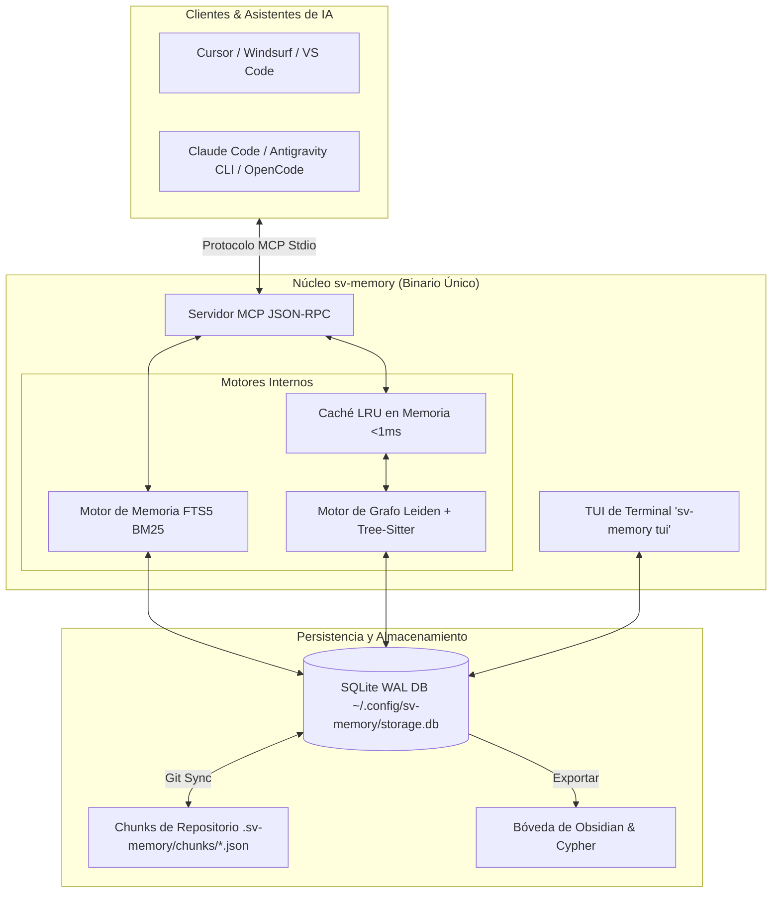

<p align="center">
  
</p>

<h1 align="center">Memoria Persistente y Grafo de Código para Agentes de IA</h1>

<p align="center">
  <b>Elimina la amnesia de contexto en agentes de IA con memoria persistente de decisiones, búsqueda FTS5 BM25 y grafos de código sub-milisegundo.</b>
</p>

<p align="center">
  <a href="LICENSE"></a>
  <a href="https://golang.org/"></a>
  <a href="https://github.com/svtech-code/sv-memory/actions/workflows/ci.yml"></a>
  <a href="https://goreportcard.com/report/github.com/svtech-code/sv-memory"></a>
  <a href="https://modelcontextprotocol.io/"></a>
  <a href="https://sqlite.org/"></a>
  <a href="README.md"></a>
</p>

<p align="center">
  <a href="#-características-clave">Características</a> •
  <a href="#-arquitectura">Arquitectura</a> •
  <a href="#-inicio-rápido">Inicio Rápido</a> •
  <a href="#-referencia-de-comandos-cli">Comandos CLI</a> •
  <a href="#-herramientas-mcp-34-herramientas">Herramientas MCP</a> •
  <a href="documentation/getting_started_guide_ES.md">Guía (ES)</a> •
  <a href="documentation/CODEBASE-GUIDE_ES.md">Código (ES)</a> •
  <a href="documentation/getting_started_guide.md">Guide (EN)</a>
</p>

---

## 📖 Enlaces Rápidos

> 💡 **¿Nuevo en sv-memory?** Revisa la [Guía Completa de Inicio e Instalación](documentation/getting_started_guide_ES.md) paso a paso ([English](documentation/getting_started_guide.md)), la [Guía del Código](documentation/CODEBASE-GUIDE_ES.md) para un recorrido de los flujos de datos clave, o la versión en [Inglés (README.md)](README.md).

---

## 🚀 Características Clave

| Categoría            | Característica             | Descripción                                                                                                                                                                  |
| :------------------- | :------------------------- | :--------------------------------------------------------------------------------------------------------------------------------------------------------------------------- |
| 🧠 **Memoria**       | **FTS5 BM25 & Scoping**    | Búsqueda de texto completo SQLite con clasificación BM25 y filtrado restringido por subdirectorio.                                                                           |
| ⚖️ **Gobernanza**    | **Decisiones Spec-Driven** | Ciclo nativo propose → validate → commit: `sv_propose_spec`/`sv_validate_decision`/`sv_commit_spec` pre-validan propuestas contra reglas e invariantes antes de escribir código, con delta requirements estilo OpenSpec (ADDED/MODIFIED/REMOVED/RENAMED + RFC 2119 + escenarios) que se fusionan en un estado por capability. |
| ⚡ **Autonomía**     | **Auto-Boot Context**      | `sv_mem_session_start` entrega el resumen de la sesión anterior, decisiones clave y hubs del grafo en 1 sola llamada.                                                        |
| 🧹 **Mantenimiento** | **Auto-Compaction Worker** | `sv_mem_compact` consolida revisiones históricas de topic keys para mantener la BD liviana.                                                                                  |
| 🕸️ **Grafo**         | **Caché LRU Sub-ms**       | Parsea 17 lenguajes, comunidades Leiden, nodos god y nodos puente con caché RAM `<1ms` validado por mtime.                                                                   |
| 🔍 **Diagnóstico**   | **Diagnóstico de Grafo**   | `DiagnoseGraph` detecta enlaces rotos, nodos huérfanos y entidades AST no vinculadas.                                                                                        |
| 🎨 **Interfaz**      | **TUI Interactiva**        | Interfaz de Usuario en Terminal (`sv-memory tui`) para inspección, búsqueda BM25 y diagnósticos.                                                                             |
| 📦 **Exportación**   | **Obsidian & Cypher**      | Exporta a notas Markdown vinculadas de Obsidian (`[[wikilinks]]`) y scripts Cypher para Neo4j / FalkorDB.                                                                    |
| 🔄 **Colaboración**  | **Git Sync Chunks**        | Sincronización Git mediante archivos `.sv-memory/chunks/{id}.json` por memoria sin conflictos para IDs distintos; las ediciones del mismo ID producen marcadores resolubles. |
| 🛡️ **Integración**   | **Hooks PreToolUse**       | Intercepta lecturas raw de archivos en Claude Code, Antigravity CLI (agy) y OpenCode para consultar la memoria primero.                                                      |

---

## 🛠️ Arquitectura



---

## 📦 Inicio Rápido

### 1. Instalación

**Binario precompilado (recomendado)** un único binario autocontenido para macOS, Linux y Windows:

```bash
# macOS / Linux
curl -fsSL https://raw.githubusercontent.com/svtech-code/sv-memory/main/install.sh | bash

# Windows (PowerShell)
iwr -useb https://raw.githubusercontent.com/svtech-code/sv-memory/main/install.ps1 | iex
```

> El instalador verifica el binario descargado contra el `checksums.txt` SHA-256
> de la release un hash que no coincida aborta la instalación.

> En macOS/Linux el binario se instala en `$HOME/.local/bin` (sin `sudo`).
> En Windows se instala en `%LOCALAPPDATA%\sv-memory` y se agrega al PATH del usuario.

**Actualizar a la última versión:**

```bash
sv-memory update
```

Esto busca la última release de GitHub, descarga el binario para tu plataforma, verifica su
checksum SHA-256 y reemplaza el ejecutable en uso. Tus memorias y configuración se guardan
por separado y nunca se ven afectadas por una actualización.

> **Tras actualizar, re-cablea tus agentes.** La actualización solo reemplaza el binario —
> no refresca tus allow-lists MCP ni el protocolo inyectado. Ejecuta `sv-memory setup --all`
> (o `setup <agente>` por agente) para que las tools MCP nuevas se otorguen y el texto del
> protocolo/skill coincida con el binario nuevo, y luego reinicia tu asistente. Ver
> [AGENT-SETUP_ES.md](documentation/AGENT-SETUP_ES.md#actualizar-sv-memory-post-update).

**Desde el código fuente** (Go puro, sin requerir CGO):

```bash
git clone https://github.com/svtech-code/sv-memory.git
cd sv-memory
go build -o sv-memory ./cmd/sv-memory
mv sv-memory ~/.local/bin/
```

### 2. Configuración Interactiva (`sv-memory configure`)

Configura editores y clientes CLI (servidores MCP) y otorga permisos de las herramientas MCP en la Fase 4:

```bash
sv-memory configure
```

### 3. Inicializar Repositorio (`sv-memory init`)

Ejecuta dentro de cualquier directorio de proyecto para registrar la BD SQLite, escanear el grafo e inyectar reglas (`AGENTS.md`):

```bash
cd /ruta/a/tu-proyecto
sv-memory init
```

### 4. Instalar Hooks PreToolUse (`sv-memory hooks install`)

Ejecuta dentro de la raíz del proyecto para que los agentes consulten la memoria antes de leer archivos:

```bash
cd /ruta/a/tu-proyecto
sv-memory hooks install --platform antigravity
# modo strict: bloquea la primera lectura raw para forzar la búsqueda en memoria
sv-memory hooks install --platform antigravity --strict
# inyección silenciosa de contexto (Claude Code): la 1ª Read de cada archivo
# inyecta un context pack compacto grafo+memorias como additionalContext (opt-in, default off)
sv-memory hooks install --platform claude-code --context-injection
```

**Modos de hook y degradación:** los scripts de hook nunca llaman al servidor sv-memory son nudges ligeros de shell que solo inspeccionan archivos locales. El modo **soft** nunca bloquea y siempre permite la lectura; el modo **strict** bloquea la _primera_ lectura de archivo de cada sesión (por boot/PWD) para que el agente consulte primero `sv_mem_search`/`sv_graph_query`. El bloqueo solo existe donde la plataforma lo soporta (Antigravity CLI); en Claude Code el modo strict es solo nudge y nunca bloquea. El modo strict es **fail-open**: si sv-memory no está inicializado (sin `.sv-memory/`), el binario no existe, o está `SV_MEMORY_STRICT_DISABLE=1`, el hook permite la lectura en lugar de bloquear al agente.

**Inyección silenciosa de contexto (`--context-injection`, opt-in):** con hooks de Claude Code, la primera `Read` de cada archivo inyecta la salida de `sv-memory context <file>` — el rol del nodo en el grafo más las memorias vinculadas (título + `why` truncado, acotado a 3) — como `additionalContext`. La salida se cachea por archivo para la sesión y está acotada en tiempo (timeout portable de 2s); el hook siempre sale con `exit 0`, así que un binario o `.sv-memory` ausente nunca rompe una llamada. Desactiva con `sv-memory hooks uninstall --context-injection`. Antigravity, Codex y OpenCode no soportan inyección por `additionalContext` y mantienen el mecanismo de nudge/skill.

### 5. Reiniciar el Agente y Verificar

Reinicia tu asistente de IA y confirma que todo quedó conectado:

```bash
sv-memory permissions status --platform antigravity   # Granted: 34 / 34
sv-memory hooks status                                # antigravity: ✅ installed
sv-memory diagnose
```

### 6. Exploración Interactiva en Terminal (`sv-memory tui`)

Navega memorias, busca con BM25, revisa diagnósticos de salud del grafo y exporta notas:

```bash
sv-memory tui
```

---

## 💻 Referencia de Comandos CLI

| Comando                            | Categoría         | Descripción                                                                                           |
| :--------------------------------- | :---------------- | :---------------------------------------------------------------------------------------------------- |
| `sv-memory init`                   | **Proyecto**      | Inicializa el repositorio, escanea el grafo de dependencias e inyecta `AGENTS.md`.                    |
| `sv-memory version`                | **Información**   | Muestra la versión actual, el hash del commit y el runtime de Go.                                     |
| `sv-memory update`                 | **Mantenimiento** | Busca nuevas releases, verifica el checksum del binario (SHA-256) y se auto-actualiza.                |
| `sv-memory mcp`                    | **Servidor**      | Inicia el servidor Model Context Protocol sobre stdio para clientes de IA.                            |
| `sv-memory tui`                    | **Interfaz**      | Inicia la interfaz interactiva de terminal para explorar memorias y diagnósticos.                     |
| `sv-memory configure`              | **Instalación**   | Asistente interactivo en terminal para configurar Cursor, Claude Code, agy, Zed, etc.                 |
| `sv-memory configure get/set/list` | **Instalación**   | Lee/escribe valores de configuración YAML global o por proyecto (`--local`).                          |
| `sv-memory setup [agente]`         | **Instalación**   | Integración de agente en un solo comando (config MCP + hooks/plugins + protocolo + permisos) para claude-code, opencode, cursor, windsurf, antigravity, codex. `--all` configura todos; sin argumentos muestra el estado por agente. Ver [AGENT-SETUP_ES.md](documentation/AGENT-SETUP_ES.md). |
| `sv-memory sync`                   | **Git Sync**      | Sincronización bidireccional entre la BD SQLite y `.sv-memory/chunks/*.json`.                         |
| `sv-memory specs export/import/list/archive/capabilities` | **Mirror Spec** | Gestiona la proyección Markdown legible por humanos de los spec changes y el estado de capabilities bajo `.sv-memory/specs/` (escrita automáticamente por el sync; `import` reconcilia ediciones humanas de vuelta al store autoritativo; `capabilities` lista el estado actual de requirements). |
| `sv-memory diagnose`               | **Diagnóstico**   | Verifica conexiones SQLite, integridad de esquema, permisos de escritura y rutas.                     |
| `sv-memory stats`                  | **Analítica**     | Muestra conteos de memorias, guardados en 24h, sesiones activas y relaciones.                         |
| `sv-memory export [archivo]`       | **Exportación**   | Exporta las memorias no eliminadas del proyecto a un archivo JSON portátil.                           |
| `sv-memory import <archivo>`       | **Importación**   | Importa memorias desde un archivo JSON usando upsert por ID.                                          |
| `sv-memory delete session <id>`    | **Mantenimiento** | Elimina una sesión vacía (falla si contiene memorias).                                                |
| `sv-memory delete project <id>`    | **Mantenimiento** | Elimina en cascada los datos de un proyecto (`--hard` los borra permanentemente).                     |
| `sv-memory projects list`          | **Proyecto**      | Lista todos los proyectos registrados con conteos de memorias/sesiones.                               |
| `sv-memory projects prune`         | **Proyecto**      | Elimina proyectos vacíos del registro central.                                                        |
| `sv-memory projects consolidate`   | **Proyecto**      | Fusiona los datos de un proyecto origen en uno destino y luego limpia el origen.                      |
| `sv-memory graph rebuild`          | **Grafo**         | Fuerza un re-escaneo completo del árbol de archivos y actualiza las tablas del grafo.                 |
| `sv-memory graph path <src> <tgt>` | **Grafo**         | Encuentra la ruta de dependencia más corta entre dos nodos de código (hasta 10 saltos).               |
| `sv-memory graph explain <nodo>`   | **Grafo**         | Muestra fan-in/fan-out, centralidad y metadatos de un símbolo o archivo.                              |
| `sv-memory graph communities`      | **Grafo**         | Detecta comunidades Leiden, nodos god y nodos puente.                                                 |
| `sv-memory graph wiki`             | **Exportación**   | Genera páginas wiki en Markdown por cada comunidad Leiden.                                            |
| `sv-memory graph viz`              | **Exportación**   | Genera una visualización HTML interactiva (`vis.js`).                                                 |
| `sv-memory graph merge <a> <b>`    | **Grafo**         | Union-merge de dos grafos de proyecto en un snapshot JSON.                                            |
| `sv-memory obsidian-export`        | **Exportación**   | Exporta memorias a una bóveda de notas Markdown de Obsidian (`[[wikilinks]]`).                        |
| `sv-memory conflicts`              | **Memoria**       | Detecta superposiciones semánticas y conflictos entre memorias del proyecto.                          |
| `sv-memory capture`                | **Memoria**       | Captura pasivamente commits de Git u observaciones en memoria persistente.                            |
| `sv-memory hooks install`          | **Hooks**         | Instala hooks PreToolUse y Git post-commit para Claude Code, Antigravity, OpenCode y Git.             |
| `sv-memory permissions list`       | **Permisos**      | Lista las 34 herramientas MCP de sv-memory con descripciones.                                         |
| `sv-memory permissions status`     | **Permisos**      | Muestra permisos MCP otorgados/faltantes por plataforma.                                              |
| `sv-memory permissions grant`      | **Permisos**      | Escribe allow-lists de herramientas MCP (`--all`/`--tool`, `--dry-run`) para Antigravity/Claude Code. |
| `sv-memory permissions revoke`     | **Permisos**      | Elimina entradas de sv-memory de la allow-list conservando permisos no relacionados.                  |

---

## 🧩 Herramientas MCP (34 Herramientas)

### 🧠 Herramientas de Memoria

- **`sv_mem_save`**: Guarda decisiones arquitectónicas, correcciones o estándares con Git sync automático, y enlaza la memoria a su nodo de código en el grafo de dependencias cuando se proporciona un `where_path`.
- **`sv_mem_update`**: Actualiza parcialmente una memoria existente por ID (conserva la identidad, avanza la revisión).
- **`sv_mem_search`**: Búsqueda FTS5 con **clasificación BM25**, filtros por categoría/ruta y **match_mode** (`all` / `any`). `graph_boost` (default activado) expande una búsqueda por `path` a toda la comunidad del grafo, anotando las filas de comunidad con `[graph]`.
- **`sv_mem_get`**: Recupera el contenido completo de una memoria específica con truncamiento opcional.
- **`sv_mem_timeline`**: Contexto cronológico alrededor de una memoria (Capa 2 de divulgación progresiva).
- **`sv_mem_suggest_topic_key`**: Genera un topic_key estable en formato `category/kebab-case` para upsert.
- **`sv_mem_judge`**: Crea relaciones entre memorias (`supersedes`, `conflicts_with`, `relates_to`).
- **`sv_mem_compare`**: Comparación lado a lado de dos memorias.
- **`sv_mem_review`**: Lista memorias obsoletas, duplicadas o candidatas a consolidación; `action="mark_reviewed"` reinicia el plazo de revisión de política de una memoria.
- **`sv_mem_stats`**: Estadísticas agregadas de memorias y desglose por categoría, más el proyecto activo actual (ID, nombre y ruta) y el **ledger de tokens de sesión** (tokens estimados inyectados desde `sv_mem_session_start` frente al presupuesto `max_response_tokens`).
- **`sv_mem_diagnose`**: Ejecuta chequeos de salud de solo lectura (base de datos, FTS5, proyecto e integridad del grafo).
- **`sv_mem_delete`**: Soft-delete (o hard-delete) de una memoria.
- **`sv_mem_pin`**: Fija una memoria local para que aparezca primero en el contexto de sesión; `action="unpin"` la desfija.
- **`sv_mem_capture_passive`**: Registra entradas de diario ligeras automáticamente.
- **`sv_mem_capture_prompt`**: Registra lo que pidió el usuario (paridad con `mem_save_prompt` de Engram) para que las futuras sesiones tengan contexto de los objetivos del usuario; recuperable vía `sv_mem_context` y contabilizado por `sv_mem_stats`. Solo local (sin git sync).
- **`sv_mem_merge_projects`**: Fusiona variantes de proyecto en un proyecto canónico (admin) — mueve todas las memorias, sesiones, relaciones y datos del grafo de `from` a `to`, y luego borra el origen. Refleja `sv-memory projects consolidate`.
- **`sv_mem_context_pack`**: Fusiona el rol del grafo + memorias vinculadas + las capabilities implementadas en una ruta en una sola llamada acotada; pasa `include_changes='true'` para listar también los spec changes activos que afectan la ruta (el puente grafo→memoria para contexto eficiente en tokens).
- **`sv_mem_conflicts`**: Muestra conflictos de memoria con análisis de superposición semántica; `action=scan semantic=true` juzga los pares candidatos con LLM vía el CLI del agente (claude/opencode).
- **`sv_mem_compact`**: Consolida revisiones históricas de topic keys en registros de síntesis unificados.

### ⚖️ Herramientas del Motor de Decisiones (Spec-Driven)

- **`sv_propose_spec`**: Registra un spec change (propuesta) y ejecuta un pre-flight check contra reglas e invariantes — una regla pinned que solapa devuelve **BLOCK**, un solapamiento ordinario **WARN**, y si no hay solapamiento **PASS**. Costo LLM cero por defecto. Acepta delta `requirements` estilo OpenSpec (ADDED/MODIFIED/REMOVED/RENAMED, RFC 2119, escenarios GIVEN/WHEN/THEN) apuntando a un único `capability_path`.
- **`sv_validate_decision`**: Re-verifica una propuesta tras ediciones (PASS/WARN/BLOCK) y valida sus delta requirements contra el estado actual de la capability (presencia RFC 2119, escenarios eliminados en MODIFIED); `semantic='true'` opta por un re-ranking batch con agente (falla abierto al veredicto determinístico).
- **`sv_commit_spec`**: Promueve un change validado a una memoria `decision`/`standard` duradera (topic_key `decision/<slug>`), cablea la arista rationale, registra relaciones `conflicts_with`, fusiona los delta requirements en el estado de la capability (`.sv-memory/specs/capabilities/` + nodos spec del grafo), y lo marca como aplicado. Un BLOCK o un conflicto de merge rechaza el commit salvo que `force='true'` lo sobreescriba.

### ⏱️ Herramientas de Sesión

- **`sv_mem_session_start`**: Registra sesión de codificación y entrega el **Paquete de Arranque Auto-Boot**.
- **`sv_mem_session_end`**: Cierra sesión activa con resumen.
- **`sv_mem_session_summary`**: Actualiza objetivo, descubrimientos, metas cumplidas y siguientes pasos.
- **`sv_mem_context`**: Recupera contexto de la última sesión completada.

### 🕸️ Herramientas de Grafo

- **`sv_graph_query`**: Consulta BFS de dependencias con caché LRU sub-milisegundo. Devuelve diagrama Mermaid.
- **`sv_graph_path`**: Ruta de dependencia más corta entre dos nodos.
- **`sv_graph_sync`**: Sincronización incremental del grafo desde cambios de archivos.
- **`sv_graph_explain`**: Información detallada de un nodo con métricas fan-in/fan-out y sugerencias accionables de refactor.
- **`sv_graph_god_nodes`**: Identifica nodos centralizados / altamente conectados.
- **`sv_graph_surprising_connections`**: Encuentra dependencias inesperadas o no obvias con resaltado de bridge score.
- **`sv_graph_viz`**: Genera visualización HTML interactiva (`vis.js`).
- **`sv_graph_merge`**: Union-merge de dos grafos de proyecto por ID de nodo en un snapshot JSON.

---

## ⚙️ Configuración en Clientes de IA

### Cursor / Claude Desktop / Windsurf

Añade el siguiente fragmento al archivo JSON de configuración MCP de tu cliente:

```json
{
  "mcpServers": {
    "sv-memory": {
      "command": "~/.local/bin/sv-memory",
      "args": ["mcp"]
    }
  }
}
```

> Usa la ruta completa a tu binario instalado: `~/.local/bin/sv-memory` en macOS/Linux,
> o `%LOCALAPPDATA%\sv-memory\sv-memory.exe` en Windows.

### Otorgar permisos a las herramientas MCP

Algunos agentes (Antigravity CLI, Claude Code) usan una allow-list estática y piden
aprobación en cada llamada a una herramienta MCP no listada. `sv-memory` puede
gestionar esa allow-list automáticamente, ya sea desde el asistente `configure`
(Fase 4) o de forma independiente:

```bash
# Muestra las 34 herramientas con descripciones
sv-memory permissions list

# Otorga las 34 herramientas a Antigravity CLI (usa --dry-run primero para previsualizar)
sv-memory permissions grant --platform antigravity --all --dry-run
sv-memory permissions grant --platform antigravity --all

# Otorga un subconjunto
sv-memory permissions grant --platform claude-code --tool sv_mem_search,sv_mem_get

# Inspecciona el estado y revoca si es necesario
sv-memory permissions status
sv-memory permissions revoke --platform antigravity
```

- **Antigravity** escribe entradas `mcp(sv-memory/<tool>)` en `~/.gemini/antigravity-cli/settings.json`.
- **Claude Code** escribe entradas `mcp__sv-memory__<tool>` en `~/.claude/settings.json`.
- **OpenCode** y **Codex** usan aprobación interactiva y se omiten (sin allow-list estática).
- Las entradas no relacionadas (p. ej. `command(npm run)`) siempre se conservan.
- Reinicia tu asistente de IA tras otorgar permisos para que cargue los cambios.

En el asistente `sv-memory configure`, la **Fase 4** lista las 34 herramientas para que
selecciones cuáles autorizar (con `a` seleccionas todas y `x` ninguna) en las plataformas
configuradas.

---

## 🔄 Sync con Git y conflictos de merge

sv-memory sincroniza tu almacén SQLite (local por clon) con los archivos `.sv-memory/chunks/{id}.json`
commiteados en Git, de modo que el equipo comparte el contexto arquitectónico entre clones.
Como cada memoria vive en su propio archivo, los agentes que editan **memorias distintas**
nunca entran en conflicto.

**Editar la _misma_ memoria no es zero-conflict.** Cuando dos clones editan la misma memoria
(típicamente vía topic-key upserts), Git deja marcadores de conflicto dentro de `{id}.json`:

```json
<<<<<<< HEAD
{ "id": "abc123", "what": "mi cambio local" }
=======
{ "id": "abc123", "what": "su cambio" }
>>>>>>> remote
```

Qué ocurre en `sv-memory sync` / auto-importación:

- Un chunk con marcadores de conflicto sin resolver (o cualquier JSON ilegible) se **omite con
  un warning**; el resto de los chunks sí se importa. No aborta todo el sync.
- Cuando un chunk traído por pull sobreescribiría una versión local **más nueva** (mayor
  `revision_count`) o **divergida en la misma revisión**, se registra un warning de
  last-writer-wins: gana el chunk de git, pero la edición local perdida queda en superficie
  en vez de descartarse en silencio.

Para resolver un chunk en conflicto: edita `{id}.json` al contenido deseado (quitando los
marcadores `<<<<<<<`/`=======`/`>>>>>>>`), haz `git add`, y vuelve a ejecutar `sv-memory sync`.
Ejecuta `sv-memory sync` después de `git pull`/`git merge` para que el servidor recoja los
cambios del equipo.

---

## 🔐 Higiene de Secretos

sv-memory está diseñado para no persistir credenciales, claves de API ni contenidos de `.env`.

- **Redacción de secretos:** todo campo de texto de una memoria es escaneado por `SanitizeText`
  (claves de OpenAI `sk-…`, Anthropic `sk-ant-…`, Google `AIzaSy…`, JWTs, claves privadas PEM,
  cadenas de conexión a BD y asignaciones genéricas `password=…`/`token=…`) **antes** de
  escribirse en SQLite tanto en el guardado normal, como en importaciones (`sv-memory import`,
  sync de chunks de git) y en los resúmenes de sesión. La redacción se re-aplica en lectura y en
  cada exportación para que los valores saneados permanezcan saneados.
- **Grafo:** los archivos `.env`, `*.pem`, `*.key`, `id_rsa` y `credentials` nunca se indexan
  (no están en las extensiones escaneadas), y el `.sv-memoryignore` por defecto también los
  excluye junto con `.ssh/`, `.aws/`, `.gcp/` y `secrets.yaml`. El texto del grafo derivado de
  contenido (encabezados markdown, comentarios `TODO:`/`WHY:`, defaults de SQL) se redacta antes
  de persistir.
- **Almacenamiento:** la base de datos SQLite vive fuera del repo (`~/.config/sv-memory/storage.db`
  por defecto) y `.gitignore` cubre `*.db`/`*.sqlite`; solo los chunks JSON por memoria (ya
  redactados) se commitean a Git para compartir con el equipo.
- **Defensa en profundidad:** como el grafo indexa archivos `.md`/`.sql` (que pueden contener
  secretos), mantén `SECRETS.md` y archivos similares fuera del grafo añadiéndolos a
  `.sv-memoryignore`.
- **Herramientas locales:** el servidor MCP solo usa stdio (sin red), los IDs de proyecto están
  hasheados y todo SQL está parametrizado; nunca se invoca una shell con entrada de usuario
  interpolada.

---

## 📄 Licencia

Desarrollado bajo el ecosistema de **SVTech**. Publicado bajo la [Licencia MIT](LICENSE).
