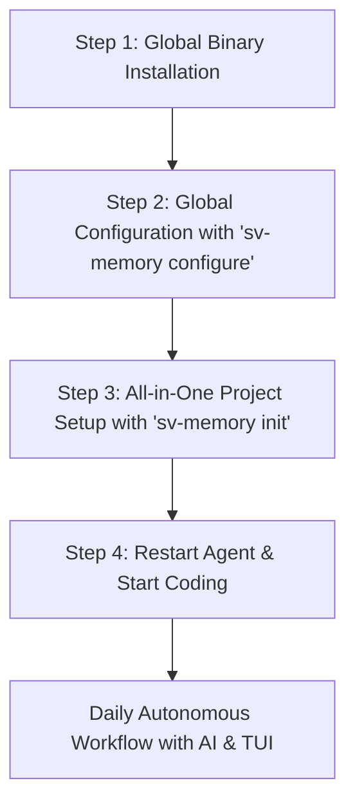

# 📖 Getting Started Guide: Installing and Initial Workflow for sv-memory

> **Language:** English | [Español](getting_started_guide_ES.md)

**sv-memory** is a persistent architectural memory and code dependency graph system designed to eliminate context amnesia in AI agents (Cursor, Claude Code, Antigravity CLI, Windsurf, etc.).

This guide explains step by step how to install **sv-memory**, configure it on your system, and start using it in your development projects.

---

## 🎯 Why Use sv-memory?

When working with AI assistants in medium or large repositories, three recurring problems arise:

1. **Session Amnesia:** The AI forgets architectural decisions made in previous sessions.
2. **Token Waste:** The AI needs to read dozens of source files over and over to understand the code structure.
3. **Lack of Continuity:** Technical decisions stay trapped in individual chats instead of being shared with the team.

**sv-memory** solves this by combining **persistent memories indexed with SQLite FTS5 BM25** and a **structural code dependency graph** exposed through 34 MCP (_Model Context Protocol_) tools.

---

## 🚀 3-Step Startup Flow



---

### Step 1: Global Binary Installation (Global Setup)

The `sv-memory` executable is a single Go binary, fully self-contained and with no external dependencies (it uses SQLite embedded in pure Go).

#### Installing with a prebuilt binary (recommended)

```bash
# macOS / Linux
curl -fsSL https://raw.githubusercontent.com/svtech-code/sv-memory/main/install.sh | bash

# Windows (PowerShell)
iwr -useb https://raw.githubusercontent.com/svtech-code/sv-memory/main/install.ps1 | iex
```

#### Building from source

```bash
# 1. Clone the repository
git clone https://github.com/svtech-code/sv-memory.git
cd sv-memory

# 2. Build the executable binary
go build -o sv-memory ./cmd/sv-memory

# 3. Move the binary to a global PATH location (no sudo needed)
mkdir -p ~/.local/bin
mv sv-memory ~/.local/bin/

# 4. Verify the installation
sv-memory --help
```

> **Why this step?**
> By placing the executable in `~/.local/bin/` (a standard user PATH location), any terminal tool or code editor on your system can invoke `sv-memory mcp` or run diagnostic commands no matter which directory you are in. The automatic installer (`install.sh` / `install.ps1`) does this step for you without requiring `sudo`.

#### Updating sv-memory

```bash
sv-memory update
```

The command looks for the latest release published on GitHub, compares it with your current version
(`sv-memory version`), and if there is a newer one:

1. It shows you both versions and **asks for confirmation** before doing anything.
2. It downloads the correct binary for your operating system and architecture.
3. It **verifies its SHA-256 checksum** against the one published in the release.
4. It replaces the binary atomically.
5. After updating, run `sv-memory init` inside your existing projects to automatically refresh skills, hooks, and new MCP tool permissions.

---

### Step 2: Global Configuration of Editors and CLIs (`sv-memory configure`)

For your editor or terminal assistant (Cursor, Claude Code, Windsurf, Antigravity CLI, OpenCode, etc.) to recognize the `sv-memory` MCP server globally, run the interactive wizard once:

```bash
sv-memory configure
```

#### What does this command do?

The wizard guides you through interactive phases in the terminal:

1. **Phase 1 (GUI Editors):** Registers the MCP server in user configuration files for **Cursor**, **VS Code**, **Zed**, or **Windsurf**.
2. **Phase 2 (Terminal Assistants):** Configures CLI clients such as **Claude Code**, **Antigravity CLI (agy)**, or **OpenCode**.
3. **Phase 3 (Confirmation and application):** Shows the summary of selected tools and applies the configurations.
4. **Phase 4 (MCP Permissions):** Authorizes the **34 sv-memory MCP tools** on platforms with static allow-lists.

---

### Step 3: All-in-One Initialization inside Your Project (`sv-memory init`)

Navigate to the root of any repository or code project where you want to work with AI and run:

```bash
cd /path/to/your-project
sv-memory init
```

#### What happens automatically when running `sv-memory init`?

`sv-memory init` handles the entire project setup in a single shot:

1. **SQLite Database & Project Registration:** Initializes project storage (`~/.config/sv-memory/storage.db`).
2. **Protocol Rules Injection (`AGENTS.md` / `.cursorrules`):** Injects the operating rules so AI agents know how to consult graph context and save decisions.
3. **Automatic Assistant Integrations (Skills & Hooks):**
   - **Antigravity CLI:** Installs `.agents/skills/sv-memory/SKILL.md` (progressive on-demand skill) and `.agents/hooks/`.
   - **OpenCode:** Installs `.opencode/skills/sv-memory/SKILL.md` and native TypeScript plugin (`sv_memory_context`).
   - **Claude Code:** Installs `.claude/hooks/` (`SessionStart`, `SessionEnd`, `PreCompact`, `PreToolUse`).
   - **Cursor / Windsurf:** Writes `.cursor/mcp.json` / `.windsurf/mcp_config.json`.
4. **Automatic MCP Tool Permissions:** Automatically grants permissions for the 34 MCP tools so the agent never asks for repetitive manual approvals.
5. **Git Memory Synchronization:** Syncs shared team memories from `.sv-memory/memories.json` if present.
6. **Code Dependency Graph:** Scans source files and builds the dependency graph (imports, god nodes, Leiden communities).

> **Re-running in existing projects:** `sv-memory init` is fully idempotent. Running it in an existing project reconciles and updates all active skills, hooks, and new tool permissions without disturbing existing configurations.

> **Optional flags:**
> - `sv-memory init --strict`: installs strict hooks (blocks raw file reads until memory/graph is queried).
> - `sv-memory init --agent antigravity`: explicitly targets a specific assistant.
> - `sv-memory init --skip-setup`: initializes DB and graph without touching agent integrations.
tool permissions) in one command, use `sv-memory setup`:

```bash
cd /path/to/your-project
sv-memory setup claude-code   # Claude Code (MCP + PreToolUse & lifecycle hooks + allow-list)
sv-memory setup opencode      # OpenCode (MCP + SKILL.md + native TS plugin)
sv-memory setup cursor        # Cursor (.cursor/mcp.json + .cursorrules)
sv-memory setup windsurf      # Windsurf (.windsurf/mcp_config.json + .windsurfrules)
sv-memory setup antigravity   # Antigravity CLI (MCP + hooks + allow-list)
sv-memory setup codex         # Codex (MCP config.toml + hooks)
sv-memory setup --all         # every agent
sv-memory setup               # read-only per-agent status
```

For Claude Code, `setup claude-code` additionally installs the lifecycle hooks
(`SessionStart`, `SessionEnd`, `PreCompact`, `SubagentStop`) so the agent is nudged to
start/end sessions, save a summary right before compaction, and persist subagent findings.
See [AGENT-SETUP.md](AGENT-SETUP.md) for the full per-agent guide.

---

### Step 5: Restarting the Agent and Verifying

Close and reopen your AI assistant so it loads the MCP, permissions, and freshly configured hooks. Then verify the status:

```bash
cd /path/to/your-project
sv-memory permissions status --platform antigravity   # Granted: 34 / 34
sv-memory hooks status                                # antigravity: ✅ installed
sv-memory diagnose                                    # 17 pass, 0 failures
```

---

### Step 6: Daily Workflow (AI Agents and Human Use)

Once the previous steps are complete, you are ready to work.

#### 🤖 1. AI Agent Autonomy (Transparent to you)

When you open your editor (Cursor, Windsurf, Claude Code, etc.) and send any message or task to the AI:

- **Session Startup (Auto-Boot Context Bundle):** The agent transparently runs `sv_mem_session_start`, immediately receiving the previous session's goals, the top 3 code hubs, and the latest postmortems / Q&A.
- **Smart Search (FTS5 BM25 + Path Scoping + Graph Boost):** When you ask it about a module or bug, the AI calls `sv_mem_search` with path filtering to find past decisions without spending thousands of tokens. With `graph_boost` (default on), a module search expands to the whole graph community in one call, annotating community rows with a `[graph]` marker.
- **Graph Query (<1ms):** If the AI needs to know which files import a module before refactoring, it queries `sv_graph_query`, getting an instant answer thanks to the in-RAM LRU cache.
- **Context Pack (Graph + Memory in one call):** Before touching a file, the AI calls `sv_mem_context_pack` (or the `sv-memory context <path>` CLI) to get the node's structural role (fan-in/fan-out, community) plus the decisions, standards, and bugfixes linked to that path — one bounded call instead of several searches, with each `why` truncated.
- **Silent Context Injection (opt-in):** With Claude Code hooks + `--context-injection`, the first Read of each file automatically injects its context pack as `additionalContext` — relevant context at the exact moment, with no search round-trip.
- **Automatic Saving:** When solving a problem or defining a standard, the AI runs `sv_mem_save`, recording the learning in SQLite and syncing it to `.sv-memory/chunks/` for your Git version control.
- **Token Ledger:** `sv_mem_stats` reports the estimated tokens injected into the session since `sv_mem_session_start` alongside the `max_response_tokens` budget, so the agent knows when to compact.

#### 📋 2. Spec-Driven Decisions (Governance)

For anything beyond a trivial fix, the agent runs the native **propose → validate → commit** cycle before writing code, optionally carrying OpenSpec-style delta requirements:

- **Consult:** `sv_mem_context_pack(path="<file|pkg>", include_changes="true")` returns the node's role, linked decisions/standards, active changes, and the **capabilities implemented at that path** (bounded requirement summary) in one call.
- **Propose:** `sv_propose_spec(slug="...", title=..., what=..., where_path=..., requirements=..., tasks=..., capability_path=...)` registers the change, runs a pre-flight check (a pinned overlapping rule → **BLOCK**, an ordinary overlap → **WARN**, otherwise **PASS**), and stores the delta requirements targeting a single capability (defaults to the slug).
- **Apply & Update Tasks:** As implementation proceeds, `sv_update_spec(change_id=..., tasks=...)` marks completed checklist items (`- [x]`) and refines design or requirements in real-time.
- **Validate:** `sv_validate_decision(change_id=...)` re-checks the proposal (PASS/WARN/BLOCK) and validates the deltas — RFC 2119 keyword presence and MODIFIED scenario drops vs the current capability state.
- **Commit:** `sv_commit_spec(change_id=...)` saves the durable `decision`/`standard` memory, merges the deltas into the capability state (`.sv-memory/specs/capabilities/` + graph `spec` nodes), and stamps the change `applied`. A BLOCK or a merge conflict rejects the commit.
- **Mirror:** every change and capability is projected to `.sv-memory/specs/` and `openspec/` (git-synced). Humans can edit the Markdown; `sv-memory specs import <slug>` reconciles the edits back into the authoritative store. `sv-memory specs capabilities` lists the current requirement state.

**Delta requirements format (OpenSpec):**

```markdown
## ADDED Requirements

### Requirement: Theme selection
The app SHALL let users switch between light and dark themes,
defaulting to the system preference.

#### Scenario: User toggles dark mode
- **WHEN** the user clicks the theme toggle
- **THEN** the app switches to dark mode and persists the choice
```

Use `## MODIFIED Requirements` to replace a whole requirement block (unlisted scenarios are dropped), `## REMOVED Requirements` to deprecate one, and `## RENAMED Requirements` (`- **FROM:**` / `- **TO:**`) to rename a header.

#### 👤 3. Human Exploration and Inspection in the Terminal (`sv-memory tui`)

As a developer, you can interactively inspect the state of knowledge and the health of your project by running:

```bash
sv-memory tui
```

From the TUI interface you can:

- **[1] List recent memories** categorized by category (`architecture`, `bugfix`, `decision`, etc.).
- **[2] Search memory** with the FTS5 BM25 engine.
- **[3] Inspect full details** of a decision by its ID or Topic Key.
- **[4] Diagnose graph health** (broken links, orphan nodes).
- **[5] Export to an Obsidian Vault** (linked `.md` notes).
- **[6] Export Cypher scripts for Neo4j / FalkorDB**.

---

## 🛠️ Quick Reference Commands

| Command                        | Description                                                      | When to use it?                                              |
| :----------------------------- | :--------------------------------------------------------------- | :----------------------------------------------------------- |
| `sv-memory configure`          | Interactive MCP setup wizard (includes Phase 4 permissions)      | On first install or when adding a new editor                 |
| `sv-memory init`               | Initializes the current project and creates `AGENTS.md`          | When starting work on a new repository                       |
| `sv-memory hooks install`      | Installs PreToolUse hooks to query memory before reading files   | When configuring Claude Code, Antigravity CLI, or OpenCode   |
| `sv-memory permissions grant`  | Grants MCP tools in the agent's allow-list (`--all` or `--tool`) | When the agent asks for permission on every MCP call         |
| `sv-memory permissions status` | Shows granted/missing MCP permissions per platform               | To audit the permission state of agents                      |
| `sv-memory permissions revoke` | Removes sv-memory MCP permissions while keeping the rest         | If you want to remove an agent's access                      |
| `sv-memory tui`                | Graphical terminal interface for querying memories               | When you want to explore past decisions interactively        |
| `sv-memory sync`               | Syncs SQLite with Git files `.sv-memory/chunks/`                 | Before running `git commit` or after `git pull`              |
| `sv-memory specs export/list/import/archive/capabilities` | Manages the spec mirror and capability state under `.sv-memory/specs/` | To review proposals, reconcile human edits, or list capabilities |
| `sv-memory diagnose`           | Health check of the system, permissions, and DB                  | If you experience any connection issue with the AI           |
| `sv-memory graph viz`          | Generates an HTML visualization of the code graph                | To visually audit your software architecture                 |
| `sv-memory obsidian-export`    | Exports memories as linked notes for Obsidian                    | To integrate technical knowledge into your personal Obsidian |

---

## 📌 Recommended Best Practices for Teams

1. **Include `.sv-memory/chunks/` in Git:** Allows the whole team to share architectural decisions. Distinct memory IDs never conflict on merge; if two agents edit the _same_ memory, resolve the resulting `{id}.json` conflict markers and re-run `sv-memory sync`.
2. **Review commits before pushing:** `sv-memory` updates memory JSONs locally, but it never runs `git commit` or `git push` automatically.
3. **Run `sv_mem_compact` periodically:** If you notice a topic has accumulated many revisions, the AI or you can run compaction to summarize the history into a clean synthesis.
4. **Keep secrets out of the graph:** `.env`, keys, and credentials are never indexed, and memory text is redacted on save/import. Add `SECRETS.md` and similar files to `.sv-memoryignore` so they are not indexed either.
