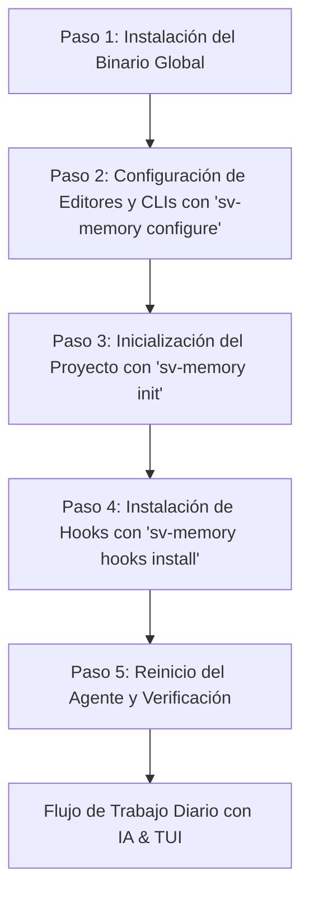

# 📖 Guía de Inicio Rápido: Instalación y Flujo Inicial de sv-memory

**sv-memory** es un sistema de memoria arquitectónica persistente y grafo de dependencias de código diseñado para eliminar la amnesia de contexto en agentes de IA (Cursor, Claude Code, Antigravity CLI, Windsurf, etc.).

Esta guía explica paso a paso cómo instalar **sv-memory**, configurarlo en tu sistema y comenzar a usarlo en tus proyectos de desarrollo.

---

## 🎯 ¿Por qué usar sv-memory?

Cuando trabajas con asistentes de IA en repositorios medianos o grandes, suceden tres problemas recurrentes:
1. **Amnesia de Sesión:** La IA olvida las decisiones arquitectónicas tomaron en sesiones anteriores.
2. **Desperdicio de Tokens:** La IA necesita leer decenas de archivos fuente una y otra vez para entender la estructura del código.
3. **Falta de Continuidad:** Las decisiones técnicas quedan atrapadas en chats individuales en lugar de compartirse con el equipo.

**sv-memory** resuelve esto combinando **memorias persistentes indexadas con SQLite FTS5 BM25** y un **grafo de dependencias estructural de código** expuesto a través de 26 herramientas MCP (*Model Context Protocol*).

---

## 🚀 Flujo de Inicio en 5 Pasos



---

### Paso 1: Instalación del Binario Global (Global Setup)

El ejecutable de `sv-memory` es un binario único en Go, completamente autocontenido y sin dependencias externas (usa SQLite integrado en puro Go).

#### Instalación con binario precompilado (recomendada):
```bash
# macOS / Linux
curl -fsSL https://raw.githubusercontent.com/svtech-code/sv-memory/main/install.sh | bash

# Windows (PowerShell)
iwr -useb https://raw.githubusercontent.com/svtech-code/sv-memory/main/install.ps1 | iex
```

#### Compilación desde código fuente:
```bash
# 1. Clonar el repositorio
git clone https://github.com/svtech-code/sv-memory.git
cd sv-memory

# 2. Compilar el binario ejecutable
go build -o sv-memory ./cmd/sv-memory

# 3. Mover el binario a una ruta global del PATH (sin sudo)
mkdir -p ~/.local/bin
mv sv-memory ~/.local/bin/

# 4. Verificar la instalación
sv-memory --help
```

> **¿Por qué este paso?** 
> Al ubicar el ejecutable en `~/.local/bin/` (una ruta estándar del PATH de usuario), cualquier herramienta de terminal o editor de código en tu sistema podrá invocar `sv-memory mcp` o ejecutar comandos de diagnóstico sin importar en qué directorio te encuentres. El instalador automático (`install.sh` / `install.ps1`) hace este paso por ti sin requerir `sudo`.

---

### Paso 2: Configuración Interactiva de Editores y CLIs (`sv-memory configure`)

Para que tu editor o asistente de terminal (Cursor, Claude Code, Windsurf, Antigravity CLI, OpenCode, etc.) reconozca el servidor MCP de `sv-memory`, ejecuta el asistente interactivo:

```bash
sv-memory configure
```

#### ¿Qué hace este comando?
El asistente te guiará a través de fases interactivas en la terminal:
1. **Fase 1 (Editores GUI):** Te permite seleccionar editores como **Cursor**, **VS Code**, **Zed** o **Windsurf**. Registra automáticamente el servidor MCP en sus archivos de configuración de usuario (ej. `claude_desktop_config.json` o settings de Cursor).
2. **Fase 2 (Asistentes de Terminal):** Te permite seleccionar clientes CLI como **Claude Code**, **Antigravity CLI (agy)** u **OpenCode**.
3. **Fase 3 (Confirmación y aplicación):** Muestra el resumen de herramientas seleccionadas y aplica las configuraciones automáticas o manuales.
4. **Fase 4 (Permisos MCP):** Lista las **26 herramientas MCP de sv-memory con su descripción** para que selecciones cuáles autorizar (números separados por coma o `all` para todas). Otorga los permisos en las plataformas configuradas que usan allow-list estática (Antigravity CLI, Claude Code).

> **¿Por qué este paso?**
> Evita que tengas que editar manualmente archivos JSON de configuración complejos. Con un par de teclas en la terminal, todos tus editores quedan enlazados al servidor MCP de `sv-memory` y los permisos de las herramientas quedan otorgados con total transparencia.

---

### Paso 3: Inicialización dentro de tu Proyecto (`sv-memory init`)

Navega a la raíz del repositorio o proyecto de código en el que deseas comenzar a trabajar e inicializa `sv-memory`:

```bash
cd /ruta/a/tu-proyecto
sv-memory init
```

#### ¿Qué sucede internamente al ejecutar `sv-memory init`?
1. **Calcula el Project ID:** Deriva un identificador único basado en el hash del repositorio Git.
2. **Registro en SQLite:** Registra el proyecto en la base de datos local SQLite (`~/.config/sv-memory/storage.db`).
3. **Escaneo del Grafo de Código:** Analiza el árbol de archivos y construye el grafo inicial de dependencias (imports, nodos god, comunidades Leiden).
4. **Sincronización Git:** Importa memorias previas compartidas por tu equipo si existe la carpeta `.sv-memory/chunks/`.
5. **Inyección de Reglas de Protocolo (`AGENTS.md`):** Crea o actualiza el archivo `AGENTS.md` en la raíz del proyecto. Este archivo contiene las instrucciones para que cualquier agente de IA sepa automáticamente **cuándo consultar**, **cuándo guardar** y **cuándo compactar** información de manera autónoma.

---

### Paso 4: Instalación de Hooks PreToolUse (`sv-memory hooks install`)

Ejecuta este paso **dentro de la raíz de tu proyecto** (los hooks se instalan en `.agents/` del proyecto, no de forma global):

```bash
cd /ruta/a/tu-proyecto
sv-memory hooks install --platform antigravity
```

#### ¿Qué hace este comando?
Crea `.agents/hooks.json` y `.agents/hooks/sv-memory.sh` para que el agente intercepte las lecturas de archivos (`view_file`, `grep_search`, `list_dir`) y consulte la memoria del proyecto antes de leer código a ciegas.

Existen dos modos:

| Modo | Comando | Comportamiento |
| :--- | :--- | :--- |
| **Soft** (por defecto) | `sv-memory hooks install --platform antigravity` | No bloquea nada. El "nudge" real lo hace el `AGENTS.md` inyectado en el Paso 3, que obliga al agente a consultar memoria. |
| **Strict** | `sv-memory hooks install --platform antigravity --strict` | Bloquea la **primera** lectura de archivo de cada sesión, forzando al agente a ejecutar `sv_mem_search`/`sv_graph_query` antes de leer. |

> Puedes cambiar de modo re-ejecutando el comando con o sin `--strict`.

> **Por proyecto:** Repite este comando en cada repositorio donde trabajes con IA. Las plataformas soportadas son `claude-code`, `codex`, `antigravity` y `opencode` (omite `--platform` para instalarlo en todas).

---

### Paso 5: Reinicio del Agente y Verificación

Cierra y vuelve a abrir tu asistente de IA para que cargue el MCP, los permisos y los hooks recién configurados. Luego verifica el estado:

```bash
cd /ruta/a/tu-proyecto
sv-memory permissions status --platform antigravity   # Granted: 26 / 26
sv-memory hooks status                                # antigravity: ✅ installed
sv-memory diagnose                                    # 17 pass, 0 failures
```

---

### Paso 6: Flujo de Trabajo Diario (Agentes de IA y Uso Humano)

Una vez completados los pasos anteriores, ya estás listo para trabajar.

#### 🤖 1. Autonomía del Agente de IA (Transparente para ti)
Al abrir tu editor (Cursor, Windsurf, Claude Code, etc.) y enviar cualquier mensaje o tarea a la IA:

- **Arranque de Sesión (Auto-Boot Context Bundle):** El agente ejecuta de forma transparente `sv_mem_session_start`, recibiendo de inmediato las metas de la sesión anterior y las 3 principales decisiones arquitectónicas del repositorio.
- **Búsqueda Inteligente (FTS5 BM25 + Path Scoping):** Cuando le haces una pregunta sobre un módulo o bug, la IA llama a `sv_mem_search` con filtrado por ruta para encontrar decisiones pasadas sin gastar miles de tokens.
- **Consulta de Grafo (<1ms):** Si la IA necesita saber qué archivos importan a un módulo antes de refactorizar, consulta `sv_graph_query`, recibiendo una respuesta instantánea gracias al caché LRU en RAM.
- **Guardado Automático:** Al resolver un problema o definir un estándar, la IA ejecuta `sv_mem_save` registrando el aprendizaje en SQLite y sincronizándolo en `.sv-memory/chunks/` para tu control de versiones en Git.

#### 👤 2. Exploración e Inspección Humana en Terminal (`sv-memory tui`)
Como desarrollador, puedes inspeccionar interactivamente el estado del conocimiento y la salud de tu proyecto ejecutando:

```bash
sv-memory tui
```

Desde la interfaz TUI puedes:
- **[1] Listar memorias recientes** clasificadas por categoría (`architecture`, `bugfix`, `decision`, etc.).
- **[2] Buscar en memoria** con motor FTS5 BM25.
- **[3] Inspeccionar detalles completos** de una decisión por su ID o Topic Key.
- **[4] Diagnosticar la salud del grafo** (enlaces rotos, nodos huérfanos).
- **[5] Exportar a una Bóveda de Obsidian** (notas `.md` vinculadas).
- **[6] Exportar scripts Cypher para Neo4j / FalkorDB**.

---

## 🛠️ Comandos de Referencia Rápida

| Comando | Descripción | ¿Cuándo usarlo? |
| :--- | :--- | :--- |
| `sv-memory configure` | Asistente interactivo de instalación MCP (incluye Fase 4 de permisos) | Al instalar por primera vez o agregar un nuevo editor |
| `sv-memory init` | Inicializa el proyecto actual y crea `AGENTS.md` | Al comenzar a trabajar en un nuevo repositorio |
| `sv-memory hooks install` | Instala hooks PreToolUse para consultar memoria antes de leer archivos | Al configurar Claude Code, Antigravity CLI u OpenCode |
| `sv-memory permissions grant` | Otorga herramientas MCP en la allow-list del agente (`--all` o `--tool`) | Cuando el agente pide permiso en cada llamada MCP |
| `sv-memory permissions status` | Muestra permisos MCP otorgados/faltantes por plataforma | Para auditar el estado de permisos de los agentes |
| `sv-memory permissions revoke` | Elimina los permisos MCP de sv-memory conservando el resto | Si quieres quitar accesos de un agente |
| `sv-memory tui` | Interfaz gráfica en terminal para consultar memorias | Cuando quieras explorar decisiones pasadas interactivamente |
| `sv-memory sync` | Sincroniza SQLite con archivos Git `.sv-memory/chunks/` | Antes de hacer `git commit` o tras hacer `git pull` |
| `sv-memory diagnose` | Chequeo de salud del sistema, permisos y BD | Si experimentas algún problema de conexión con la IA |
| `sv-memory graph viz` | Genera una visualización HTML del grafo de código | Para auditar visualmente la arquitectura de tu software |
| `sv-memory obsidian-export` | Exporta memorias como notas vinculadas para Obsidian | Para integrar el conocimiento técnico en tu Obsidian personal |

---

## 📌 Mejores Prácticas recomendadas para Equipos

1. **Incluye `.sv-memory/chunks/` en Git:** Permite que todo el equipo comparta las decisiones arquitectónicas sin conflictos de merge.
2. **Revisa los commits antes de subir:** `sv-memory` actualiza los JSON de memoria localmente, pero nunca ejecuta `git commit` o `git push` automáticamente.
3. **Ejecuta `sv_mem_compact` periódicamente:** Si notas que un tema ha acumulado muchas revisiones, la IA o tú pueden ejecutar compactación para resumir el historial en una síntesis limpia.
